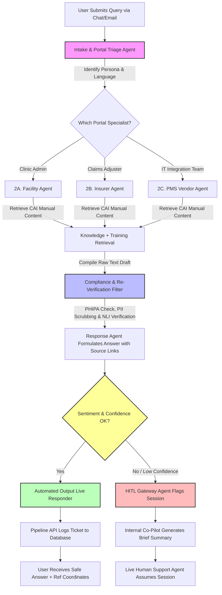

# Multi-Agent Customer Support Crew: Market Research Document

**Capstone Project:** Multi-Agent Customer Support Crew  
**Pilot Focus:** CAI (Claim for Insurance) — NYC auto insurance health claims support  
**Primary Knowledge Source:** [CAIInfo.ca](https://www.CAIinfo.ca/)  
**Selected Runtime:** `AAMAD_TARGET_RUNTIME=crewai`  
**Research Depth:** Lean (pilot-scoped; assumptions labeled where primary data is unavailable)

### Resolved Pilot Decisions

| Decision                    | Selection                                                                                                                  |
| --------------------------- | -------------------------------------------------------------------------------------------------------------------------- |
| **Ticketing platform**      | ServiceNow — **Case** table via Table API                                                                                  |
| **MVP persona portals**     | All three — Health Care Facilities, Insurers, PMS Vendors                                                                  |
| **Content ingestion**       | **Full-site crawl** of public CAIInfo.ca pages (scheduled re-crawl + portal metadata)                                      |
| **Voice stack**             | Azure Speech (STT/TTS) — **Canada region**                                                                                 |
| **Data residency**          | Logs, embeddings, and Azure Speech processing **within Canada**                                                            |
| **Compliance (primary)**    | **HIPAA**                                                                                                                  |
| **Languages**               | English + **French** (pilot scope)                                                                                         |
| **Golden set validation**   | **Support Team SME**                                                                                                               |
| **MVP budget**              | Free-tier / no-cost tiers acceptable for OpenAI + Azure Speech                                                             |
| **ServiceNow routing**      | Separate **assignment groups + categories** for all three portals (Facilities, Insurers, PMS Vendors)                      |
| **OpenAI compliance**       | **BAA required**; data-flow design aligned with HIPAA + Canada residency                                                   |
| **French content strategy** | Use CAIInfo.ca FR pages where available; **on-demand EN→FR translation** of retrieved EN content when user requests French |

---

## Executive Summary

### Market Opportunity

NYC’s **Claim for Insurance (CAI)** platform is mandatory for transmitting standardized NYC Claim Forms (OCFs)—including OCF-18s, OCF-23s, Form 1, and related invoices—between health care facilities and auto insurers. [CAIInfo.ca](https://www.CAIinfo.ca/) is the official information resource for enrolment, administration, and step-by-step workflow guidance across three primary audiences: **health care facilities**, **insurers/adjusters**, and **practice management software (PMS) vendors**.

Stakeholders face a recurring support burden: finding the right procedure on a large, portal-structured site—often by **manually searching** or **watching full training videos**—before they can act in CAI. This creates onboarding delays, mis-submitted OCFs, and repeated calls to Support Team support. Broader **AI in customer service** markets are growing rapidly (industry estimates ~$13B in 2024, projected >$80B by 2033), but **domain-specific, citation-grounded support** for regulated claims workflows remains underserved.

### Technical Feasibility

A **CrewAI multi-agent crew** with **OpenAI managed APIs**, **RAG over CAIInfo.ca content**, and **real integrations** (ticketing + voice/chat) is feasible for a pilot. The architecture should prioritize **grounded answers with source links**, **workflow/impact mapping** (which OCF, role, and CAI module is affected), and **automated ticket creation** with structured context for human agents. Primary technical risks—**hallucinations**, **integration complexity**, and **LLM cost**—are manageable with retrieval-only grounding, confidence thresholds, human handoff, and prompt/token controls.

### Recommended Approach

**Proceed with pilot development.** Scope MVP to chat + voice (English and French), full-site CAIInfo.ca RAG, sentiment-aware escalation, human handoff with context summary, ServiceNow **Case** creation, and an agent copilot for Support Team support staff. Deploy logs, embeddings, and Azure Speech **within Canada**. Design to **HIPAA** as the primary compliance frame. Use free-tier OpenAI and Azure Speech where sufficient for MVP traffic.

---

## Problem Statement

| Dimension      | Description                                                                                                                                                         |
| -------------- | ------------------------------------------------------------------------------------------------------------------------------------------------------------------- |
| **Who**        | Health care facility admins, insurers/adjusters, PMS vendors, and new CAI users seeking enrolment or OCF workflow help                                              |
| **What**       | Users struggle to locate accurate, actionable CAI guidance on CAIInfo.ca without time-consuming manual search or full video consumption                             |
| **Impact**     | Slower enrolment, incorrect form submissions, rework on OCF adjudication, increased support tickets, and user frustration                                           |
| **Why now**    | CAI is mandatory for OCF transmission in NYC; FSRA-governed workflows change; GenAI enables citation-grounded self-service without replacing human adjudication |
| **Pilot goal** | Prove an agent crew can answer CAI user questions, map workflows/impacted areas, create tickets, and cite CAIInfo.ca sources                                        |

### Validated Pain Points (Pilot Priority)

1. **Manual information search** — Users navigate multi-portal content (Facilities, Insurers, PMS Vendors) without conversational guidance.
2. **Video-first learning friction** — Critical steps are embedded in long videos; users need **extracted answers** and **deep links** to the exact page/section.
3. **Implicit third pain (derived)** — **No single action path** from question → answer → ticket → human follow-up; support is fragmented across site search, email, and phone.

---

## 1. Market Analysis & Opportunity Assessment

### 1.1 Domain Context

- **CAI** is the electronic system for OCF exchange between NYC health care facilities and auto insurers, operated by **Support Team** (not-for-profit), governed by **FSRA** under the CAI Guideline.
- **CAIInfo.ca** provides enrolment guidance, management/admin instructions, provider/adjuster support, and privacy procedures—organized by persona-specific portals.
- **Mandatory participation:** Insurers writing auto insurance in NYC and facilities submitting specified OCFs must use CAI.

### 1.2 Target User Segments & Personas

| Persona                                  | Role                                             | Primary Goals                                         | Current Workflow Challenges                                                             |
| ---------------------------------------- | ------------------------------------------------ | ----------------------------------------------------- | --------------------------------------------------------------------------------------- |
| **Facility Administrator**               | Health care facility enrolment & user management | Enrol facility, manage users, submit OCF-18/23/Form 1 | Unclear enrolment criteria; multi-location rules; finding step-by-step OCF instructions |
| **Clinical/Admin Staff (Facility User)** | Day-to-day CAI form submission                   | Submit/track OCFs, confirm treatment plans            | Navigating CAIinfo site map; interpreting which OCF applies; video-heavy training       |
| **Insurer Adjuster**                     | Adjudicate OCFs in CAI                           | Review worklists, approve/deny, communicate decisions | Locating adjuster-specific guides; understanding workflow impacts across OCF types      |
| **PMS Vendor / Integrated Facility**     | Software integration with CAI                    | PMS setup, updates, vendor support flows              | Technical docs scattered across vendor portal; integration error resolution             |
| **Support Team Support Agent (Internal)**        | Tier-2 human support                             | Resolve escalated tickets with accurate citations     | Repetitive FAQ tickets; incomplete context from users                                   |

### 1.3 Market Gap

| Gap                                 | Current State                           | Unmet Need                                                                  |
| ----------------------------------- | --------------------------------------- | --------------------------------------------------------------------------- |
| **Discovery**                       | Static site search + videos             | Conversational, persona-aware navigation of CAIInfo.ca                      |
| **Answer trust**                    | User interprets content alone           | **Citation-backed** answers with links to authoritative pages               |
| **Action closure**                  | User must open separate support channel | **Auto-created tickets** with suggested resolution and source references    |
| **Workflow clarity**                | Implicit in long guides                 | Explicit **workflow + impacted areas** (OCF type, portal, role)             |
| **Voice + chat + bilingual parity** | Web self-service only; EN-heavy         | Same grounded crew behind **chat and voice** in **EN + FR** with escalation |

### 1.4 Opportunity Size (Lean Estimate)

| Segment                                | Sizing Logic                                         | Pilot Relevance                                                  |
| -------------------------------------- | ---------------------------------------------------- | ---------------------------------------------------------------- |
| **NYC auto insurers**              | All writers must enrol in CAI                        | Insurer adjuster support use cases                               |
| **NYC rehab/treatment facilities** | Mandatory CAI submission for specified OCFs          | High-volume enrolment & submission questions                     |
| **PMS vendors**                        | Subset of integrated facilities                      | Lower volume, higher complexity                                  |
| **Broader AI support TAM**             | Global AI customer service market growing ~20%+ CAGR | Validates technology spend trend; not primary TAM for this pilot |

**Pilot SAM:** Support Team support channels + enrolled facilities/insurers seeking CAIInfo.ca guidance (internal or partner pilot—not full NYC market rollout).

### 1.5 Competitive & Alternative Landscape

| Solution                           | Type                            | Strengths                                        | Limitations for CAI Use Case                                                    |
| ---------------------------------- | ------------------------------- | ------------------------------------------------ | ------------------------------------------------------------------------------- |
| **CAIInfo.ca (status quo)**        | Official documentation & videos | Authoritative, comprehensive                     | Poor conversational discovery; video friction; no ticket automation             |
| **Generic site search**            | Browser/site search             | Fast for known keywords                          | No workflow mapping; no escalation; no citations packaged for tickets           |
| **ServiceNow + Now Assist**        | Enterprise ITSM / CSM AI        | Native ticketing, workflow, copilot              | Generic; not pre-grounded on CAIInfo.ca without custom RAG                      |
| **Forethought / Cognigy / Ada**    | Enterprise AI support           | Multi-channel, escalation                        | Cost/complexity for capstone; domain grounding still required                   |
| **Single chatbot (ChatGPT-style)** | General LLM                     | Fluent answers                                   | **Hallucination risk** on regulated forms; no structured ticket/source pipeline |
| **This pilot (CrewAI crew)**       | Domain multi-agent              | RAG on CAIInfo.ca + ticket + copilot + citations | Requires maintenance when CAIInfo.ca changes; integration effort                |

### 1.6 Key Differentiators (Multi-Agent Approach)

1. **Answer + cite + act** — Respond to user query, attach **CAIInfo.ca source URLs/sections**, and **create a ticket** with suggested resolution.
2. **Workflow intelligence** — Explicitly state **affected workflow** (e.g., enrolment, OCF-18 submission, adjuster worklist) and **impacted areas** (persona portal, form type, system module).
3. **Role-specialized agents** — CrewAI agents for triage, CAI retrieval, response drafting, training guidance, sentiment/escalation, ticket creation, and human copilot—vs. one monolithic bot. Create different agents for facility and isurers flow.
4. **Human-in-the-loop by design** — Escalation with **context summary** for Support Team support agents; copilot suggests replies grounded in the same retrieval pipeline.
5. **Auditability** — Agent decision trail supports compliance reviews (who asked, what sources were used, what ticket was created).

---

## 2. Technical Feasibility & Requirements Analysis

### 2.1 CrewAI Fit (`AAMAD_TARGET_RUNTIME=crewai`)

| Capability         | Application                                                           |
| ------------------ | --------------------------------------------------------------------- |
| Role-based agents  | Persona-specific triage (facility vs insurer vs PMS)                  |
| Task chaining      | Triage → Retrieve → Respond → Sentiment → Ticket → (optional) Copilot |
| Tool binding       | RAG retriever, ticket API, sentiment analyzer, citation formatter     |
| Sequential process | Deterministic MVP pipeline aligned with adapter-crewai rules          |

**Limitations:** LLM non-determinism, token cost, and need for explicit guardrails on regulated content.

### 2.2 Proposed MVP Agent Crew

| Agent                                             | Responsibility                                                                              | Key Outputs                                                   |
| ------------------------------------------------- | ------------------------------------------------------------------------------------------- | ------------------------------------------------------------- |
| **Triage Agent**                                  | Classify intent, persona, language (EN/FR), urgency, channel                                | Route + portal filter + locale                                |
| **CAI Knowledge Agent**                           | RAG retrieval over CAIInfo.ca (chunked docs/pages)                                          | Top-k passages + canonical URLs                               |
| **Training Guide Agent**                          | Convert procedural content into step lists; reference videos only as supplementary          | Step-by-step guidance + deep links                            |
| **Response Agent**                                | Compose user-facing answer from retrieved context; FR requests may use translated EN source | Answer + citations (+ translation flag) + confidence score    |
| **Sentiment & Escalation Agent**                  | Detect frustration/confusion; low-confidence triggers                                       | Escalate flag + priority                                      |
| **Ticket Agent**                                  | Create ServiceNow **Case** via Table API                                                    | Case number, category, suggested solution, CAIInfo.ca sources |
| **Handoff Agent**                                 | Package summary for human agent                                                             | Context bundle for copilot UI                                 |
| **Copilot Agent (internal)**                      | Assist Support Team support staff on open tickets                                                   | Suggested reply + sources (human approves)                    |
| **Complaince & Re-verification Agent (internal)** | PHIPA PII Scrubber (Cleans names, health card numbers)                                      | Cross-Checks Text vs. Source Docs (Zero Hallucination)        |

### 2.3 Integration Requirements (Real Integrations — Pilot)

| Integration                      | Purpose                                               | Pilot Notes                                                                                                                               |
| -------------------------------- | ----------------------------------------------------- | ----------------------------------------------------------------------------------------------------------------------------------------- |
| **CAIInfo.ca full-site indexer** | RAG corpus from all public pages across three portals | Full-site crawl; tag chunks with portal, URL, language (EN/FR native), last-crawled date; store EN originals for on-demand FR translation |
| **Vector store (Canada)**        | Embeddings for semantic search                        | Host in **Canadian region** (e.g., Azure AI Search, pgvector on Canadian Azure); portal + language metadata filters                       |
| **ServiceNow Case**              | Create/update customer service cases                  | Table API → Case table; route to portal-specific **assignment group + category** (see below)                                              |
| **Chat UI**                      | Customer-facing channel                               | Web chat; **English + French** language selector or auto-detect                                                                           |
| **Azure Speech (Canada)**        | Voice STT/TTS                                         | Azure Speech SDK in **Canadian region**; FR-CA and EN-CA locales; same CrewAI backend as chat                                             |
| **OpenAI API**                   | Managed LLM for agents + EN→FR translation            | **BAA in place**; free/low-cost tier for MVP; HIPAA-aligned settings; document cross-border data flow vs Canada residency                 |
| **Logging/audit store (Canada)** | Prompt trace, citations, Case linkage                 | Persist logs and audit data in **Canada** only                                                                                            |

#### ServiceNow Portal Routing (Pilot)

| Triage Portal              | Assignment Group           | Category (illustrative)                     |
| -------------------------- | -------------------------- | ------------------------------------------- |
| **Health Care Facilities** | `CAI - Facilities Support` | Facility enrolment / OCF submission / admin |
| **Insurers**               | `CAI - Insurers Support`   | Adjuster workflow / adjudication / admin    |
| **PMS Vendors**            | `CAI - PMS Vendor Support` | PMS integration / vendor setup / technical  |

*Ticket Agent sets `assignment_group` and `category` from triage persona; exact ServiceNow group names configured in sandbox.*

#### ServiceNow Case Field Mapping (Pilot)

| Crew Output               | ServiceNow Case Field (illustrative)                                  |
| ------------------------- | --------------------------------------------------------------------- |
| User query + AI answer    | `short_description`, `description`                                    |
| Persona portal            | `category` / custom field                                             |
| Language (EN/FR)          | Custom field                                                          |
| Workflow + impacted areas | Work notes / custom field                                             |
| CAIInfo.ca citations      | Work notes / attachment links                                         |
| Suggested resolution      | Work notes / `close_notes` draft                                      |
| Escalation flag           | Priority / **portal assignment group** (Facilities, Insurers, or PMS) |

### 2.4 LLM & Cost Strategy

- **Primary:** OpenAI managed API on **free / lowest-cost tier** with **BAA** for HIPAA-aligned pilot use.
- **Grounding rule:** Responses must be generated from retrieved CAIInfo.ca chunks; if retrieval confidence < threshold → escalate, do not invent OCF rules.
- **Bilingual:** Triage detects EN vs FR. Prefer native FR pages from CAIInfo.ca. When user requests French and only EN content exists, **translate retrieved EN passages at response time**; always cite the **original EN source URL** and mark response as translated.
- **Cost control:** gpt-4o-mini (or equivalent) for triage/response/translation; cache frequent FAQ embeddings; strict token/session caps; Azure Speech free tier where available.

### 2.5 Technical Risks & Mitigations

| Risk                             | Severity | Mitigation                                                                                                     |
| -------------------------------- | -------- | -------------------------------------------------------------------------------------------------------------- |
| **Hallucinations**               | High     | RAG-only answers; mandatory citations; confidence gating; human review on escalation                           |
| **Integration complexity**       | High     | Phase: CAIInfo.ca index + chat → ServiceNow → Azure Speech voice                                               |
| **Multi-portal retrieval noise** | Medium   | Portal-aware triage + metadata filters on vector search                                                        |
| **Free-tier rate limits**        | Medium   | Queue/throttle; cache; fallback to chat-only if voice quota exceeded                                           |
| **French corpus gaps**           | Medium   | Prefer native FR pages; **on-demand EN→FR translation** with original EN citation; SME review on golden FR set |
| **Translation fidelity**         | Medium   | Translate retrieved chunks only (not free-form); flag `translated_from_en` in response metadata                |
| **Stale CAI content**            | Medium   | Scheduled re-index; source fetch date in every answer                                                          |
| **Voice latency**                | Medium   | Stream STT; partial retrieval while user speaks                                                                |
| **PHI in tickets**               | High     | Minimize PHI collection; redact logs; encryption in transit/at rest                                            |

---

## 3. User Experience & Workflow Analysis

### 3.1 End-User Journey (Chat / Voice)

1. User asks via **chat or voice** (e.g., “How do I enrol my clinic?” or “Which OCF for treatment plan change?”).
2. **Triage** identifies persona (facility/insurer/PMS) and intent (enrolment, OCF submission, admin).
3. **Knowledge + Training agents** retrieve CAIInfo.ca content; training agent produces steps without requiring full video watch.
4. **Response agent** returns answer with **source links** and **workflow/impact summary**.
5. **Sentiment agent** evaluates tone and confidence; low confidence → escalation.
6. **Ticket agent** creates ServiceNow **Case** with suggested solution + citations.
7. If escalated, **human agent** receives copilot summary and recommended reply.

Step 1: User Submission **chat or voice** (Ingress)
The end-user  (e.g., a Clinic Administrator or an Insurance Adjuster) submits a highly technical CAI question via Web Chat or Email (e.g., "How do I reactivate a deactivated user account?" or "Why is this OCF-21B flagging an invalid facility license error?").

Step 2: Intake & Portal **Triage**
The Intake & Portal Triage Agent instantly analyzes the text. It detects the language (English or French) and runs a fast classification pass to identify the user persona (Facility side vs. Insurer side vs. PMS Tech Vendor) and the core functional intent (User Management, Form Validation, or System Status).

Step 3: **Domain-Specialized Retrieval**
The session state is transferred cleanly to the corresponding portal specialist agent:
The Facility Agent pulls context chunks strictly from the CAI Facility User Manual.
The Insurer Agent pulls context chunks strictly from the CAI Insurer Guideline Manual.
The system’s integrated operational workflows synthesize explicit, actionable text-based troubleshooting steps, eliminating the need for the user to navigate complex manuals or watch lengthier video training assets.

Step 4: **Compliance Filtration & Response Assembly**
The Compliance & Re-Verification Filter intercepts the generated text. It executes two crucial tasks:
PHIPA Scrubbing: Identifies and strips out any illegally typed personal identifier strings (e.g., claimant names or real health card numbers).
Anti-Hallucination Core Check: Compares the instructions against the retrieved database text blocks to guarantee operational accuracy. The Response Agent then packages the finalized text along with transparent source page citations.

Step 5: **Sentiment & Confidence Evaluation**
The Compliance Filter analyzes both the user's phrasing style and the model's extraction accuracy to output a final certainty score.
Path A (High Confidence / Normal Sentiment): The system passes the draft directly to the output engine.
Path B (Low Confidence / High Frustration): If the rule is ambiguous or the user exhibits escalating frustration, the engine triggers a soft hold parameter to intercept autonomous output.

Step 6: **Automated Resolution or Live Human Handoff**
If Verified Clear: The Live Responder instantly pushes the clean, compliant solution directly to the user’s active web chat window or updates their email thread, while a backend code function seamlessly updates your CRM ticket database in the background.
If Escalated: The HITL Gateway Agent immediately assigns the live chat thread to a human operator. The human supervisor enters the system with an internal Co-Pilot Summary panel already open, showing them exactly what went wrong and displaying an optimized, pre-vetted draft answer they can use to finish the interaction smoothly.

### 3.2 Workflow & Impacted Areas (KPI Dimension)

Every resolved or escalated interaction should output:

| Field                     | Example                                        |
| ------------------------- | ---------------------------------------------- |
| **Workflow**              | Facility enrolment → Authorizing Officer setup |
| **Impacted OCF/artifact** | OCF-18, OCF-23, Form 1                         |
| **Portal**                | Health Care Facilities → New to CAI            |
| **Role**                  | Facility Administrator                         |
| **Suggested next action** | Complete enrolment step 2; link to page        |

### 3.3 Human-in-the-Loop

| Scenario                                     | Behavior                                      |
| -------------------------------------------- | --------------------------------------------- |
| Low retrieval confidence                     | Escalate; ticket marked “needs human review”  |
| Regulated ambiguity (eligibility, licensing) | Provide sources; recommend human confirmation |
| Negative sentiment                           | Priority escalation + copilot alert           |
| Copilot mode                                 | AI suggests; **human sends** official reply   |

### 3.4 Pilot Success Metrics (KPI Targets)

| KPI                            | Definition                                                         | Pilot Target                          |
| ------------------------------ | ------------------------------------------------------------------ | ------------------------------------- |
| **Query answer rate**          | % of user queries receiving a grounded response                    | ≥ 80% of pilot test queries           |
| **Citation accuracy**          | Support Team SME–validated: sources support the answer                     | ≥ 90% on golden question set          |
| **Workflow accuracy**          | Correct workflow + impacted areas identified                       | ≥ 85% on scripted scenarios           |
| **Ticket creation**            | Valid ServiceNow **Case** with category + suggested solution       | 100% of flows that require follow-up  |
| **Escalation appropriateness** | Escalations match rubric                                           | ≥ 80% precision (pilot eval)          |
| **Bilingual answer rate**      | FR/EN queries answered in correct language with grounded citations | ≥ 80% on FR golden subset             |
| **Time-to-answer**             | Chat first response                                                | < 15 seconds median (excl. voice STT) |

*Golden question set (30–40 total, ~10–13 per portal, including FR scenarios) validated by **Support Team SME** before evaluator demo.*

---

## 4. Production & Operations Requirements (Pilot Scope)

### 4.1 Deployment (Pilot)

- Containerized CrewAI backend + API gateway + chat frontend + **Azure Speech** voice adapter.
- **Mandatory Canadian data residency:** logs, vector embeddings, audit store, and Azure Speech in a **Canada Azure region** (e.g., Canada Central / Canada East).
- OpenAI: **BAA required**; configure API for HIPAA-aligned use; document any cross-border inference vs **Canada-only** storage of logs/embeddings/audit data in SAD.

### 4.2 Security & Compliance

| Requirement                              | Pilot Implementation                                                                                               |
| ---------------------------------------- | ------------------------------------------------------------------------------------------------------------------ |
| **HIPAA (primary)**                      | Primary compliance frame; **OpenAI BAA** + vendor BAAs where applicable; minimize PHI; access controls; audit logs |
| **OpenAI data flow**                     | **BAA required**; PHI minimization in prompts; pilot artifacts (logs, embeddings) remain in **Canada**             |
| **Canadian data residency**              | Logs, embeddings, Azure Speech, and audit data stored/processed **within Canada**                                  |
| **PHIPA / PIPEDA (jurisdictional note)** | NYC operation may implicate Canadian privacy law; document in SAD as secondary under HIPAA-primary frame       |
| **Encryption**                           | TLS 1.2+ in transit; AES-256 at rest for logs/cases                                                                |
| **Access control**                       | RBAC for copilot vs end-user channels                                                                              |
| **Retention**                            | Define log/case retention; support deletion requests                                                               |
| **AI transparency**                      | Disclose AI-assisted responses; flag machine-translated FR content; easy path to human                             |
| **Bilingual**                            | EN + FR UI/responses; on-demand EN→FR translation when native FR pages missing; cite EN source                     |

### 4.3 Monitoring

- Retrieval hit rate, citation coverage, escalation rate, ticket creation success, OpenAI token usage, voice error rate.
- Alert on spike in low-confidence or failed ticket API calls.

### 4.4 Cost Structure (Lean)

| Item                         | Pilot Cost Driver                                            |
| ---------------------------- | ------------------------------------------------------------ |
| OpenAI API                   | **Free / low-cost tier** for MVP; per-token with strict caps |
| Vector DB + hosting (Canada) | Azure free/low tier in Canadian region                       |
| Azure Speech (Canada)        | **Free tier** where sufficient; FR-CA + EN-CA                |
| ServiceNow                   | Existing instance + API credentials assumed                  |

---

## 5. Innovation & Differentiation Analysis

### 5.1 Unique Value Proposition

> **“Ask CAI in plain language—get the answer, the official source, the workflow impact, and a support ticket if you need follow-up.”**

Unlike generic chatbots, this crew is **purpose-built for CAIInfo.ca workflows**, combining **multi-agent specialization** with **action closure** (ticket + copilot), reducing reliance on manual search and full-video training.

### 5.2 Comparison to Single-Agent Alternative

| Dimension        | Single LLM Bot | Multi-Agent Crew (Pilot)                  |
| ---------------- | -------------- | ----------------------------------------- |
| Grounding        | Prompt-only    | Dedicated retrieval + citation agent      |
| Workflow mapping | Ad hoc         | Training + triage agents encode structure |
| Ticket quality   | Manual         | Ticket agent with structured fields       |
| Escalation       | Basic          | Sentiment + confidence + handoff agents   |
| Audit            | Opaque         | Per-agent trace logs                      |

### 5.3 Future Extensions (Post-Pilot)

- Proactive alerts when CAIInfo.ca content changes affect open Cases.
- Additional locales beyond EN/FR if CAIInfo.ca expands.
- Deeper PMS vendor API diagnostics (if APIs available).
- Analytics dashboard for Support Team on top FAQ themes by portal and language.

---

## Critical Decision Points

### Go / No-Go

| Go                                                        | No-Go                                         |
| --------------------------------------------------------- | --------------------------------------------- |
| Pilot sponsor access to CAIInfo.ca corpus + ticketing API | Cannot ground answers or create real tickets  |
| Golden question set validated by **Support Team SME**             | Hallucination rate unacceptable on golden set |
| HIPAA controls + Canadian residency design approved       | Compliance blockers unresolved                |
| OpenAI + CrewAI spike succeeds in 1 week                  | Integration effort exceeds capstone timeline  |

### Architecture Choices

- **Orchestration:** CrewAI sequential crew (MVP).
- **LLM:** OpenAI managed API with RAG; no fine-tune in MVP.
- **Channels:** Chat first, voice second (reduces integration risk).
- **Knowledge:** Full-site public CAIInfo.ca crawl with portal + language metadata.
- **Ticketing:** ServiceNow **Case** with portal-specific assignment groups (Facilities, Insurers, PMS).
- **Voice:** Azure Speech SDK (EN-CA / FR-CA) in Canada region.
- **Data residency:** Canada-only for logs, embeddings, Speech.
- **Compliance:** HIPAA primary.
- **Languages:** English + French (native FR + on-demand EN→FR translation with EN source citation).
- **OpenAI:** BAA required for HIPAA alignment.

### Market Positioning (Pilot Narrative)

- **Position as** domain-specific **CAI support copilot**, not replacement for FSRA/Support Team adjudication or official policy interpretation.
- **Target pilot users:** New facility enrollees, insurer adjuster trainees, and PMS vendor integrators—all with high CAIInfo.ca navigation friction.

---

## Risk Assessment Matrix

| Risk                                     | Level      | Impact                                                                                                  | Mitigation                                               |
| ---------------------------------------- | ---------- | ------------------------------------------------------------------------------------------------------- | -------------------------------------------------------- |
| LLM hallucination on OCF rules           | **High**   | Wrong clinical/claims action                                                                            | RAG-only; citations required; escalate if low confidence |
| Integration complexity (ticket + voice)  | **High**   | Schedule slip                                                                                           | Phased delivery; mock voice only if blocked              |
| OpenAI free-tier limits                  | **Medium** | Throttle, cache, gpt-4o-mini, session caps                                                              |                                                          |
| Evaluator expectations vs scope          | **Medium** | Support Team SME golden set + demo script aligned to KPIs                                                       |                                                          |
| HIPAA + Canada residency with OpenAI BAA | **Medium** | BAA executed; PHI minimization; Canada-only storage for pilot artifacts; document inference flow in SAD |                                                          |
| CAIInfo.ca content drift                 | **Medium** | Stale answers                                                                                           | Re-index job + “last updated” in UI                      |
| User trust in AI for regulated domain    | **Medium** | Low adoption                                                                                            | Human handoff + official source links prominent          |
| Feature creep (full omnichannel)         | **Low**    | Delay MVP                                                                                               | Strict pilot scope gate in PRD                           |

---

## Actionable Recommendations

### Immediate (48–72 hours)

- Configure ServiceNow **assignment groups** for all three portals (Facilities, Insurers, PMS Vendors) + Case field mapping.
- Execute **OpenAI BAA** and document HIPAA + Canada residency data-flow in architecture prep.
- Build **golden question set** (30–40, EN + FR, ~10–13 per portal); submit to **Support Team SME** for validation.
- Spike: **full-site** CAIInfo.ca crawl → Canadian-hosted vector index → portal/language-filtered RAG → cited answer.
- Spike: ServiceNow **Case** creation from Ticket Agent output.
- Confirm OpenAI + Azure Speech **free-tier** quotas sufficient for demo load.

### Short-Term (30 days — MVP)

- Deploy chat channel with full agent pipeline through **ServiceNow** ticket creation.
- Implement copilot pane for human agents on escalations.
- Run evaluator demo against KPI rubric (answer, workflow, ticket).
- Add **Azure Speech** voice channel if chat + ServiceNow KPIs met.

### Mid-Term (Post-Pilot)

- Expand corpus coverage; automate content refresh.
- Production hardening: SLA, monitoring, cost dashboards.
- Partner discussions with Support Team/training stakeholders if pilot succeeds.

---

## Sources

| #   | Source                                                                                                         | Use                                                                                                        |
| --- | -------------------------------------------------------------------------------------------------------------- | ---------------------------------------------------------------------------------------------------------- |
| 1   | [CAIInfo.ca — Welcome](https://www.CAIinfo.ca/)                                                                | Domain overview, portals, system status                                                                    |
| 2   | [Intro to CAI — Insurers](https://www.CAIinfo.ca/insurers/new-to-CAI/intro-to-CAI)                             | Mandatory OCF transmission, governance                                                                     |
| 3   | [Intro to CAI — Health Care Facilities](https://www.CAIinfo.ca/health-care-facilities/new-to-CAI/intro-to-CAI) | Facility enrolment, navigation pain context                                                                |
| 4   | [CAI Governance](https://www.CAIinfo.ca/insurers/new-to-CAI/CAI-governance)                                    | FSRA/Support Team roles, CPA function                                                                              |
| 5   | [Should I Enrol?](http://www.CAIinfo.ca/Health-Care-Facility/New-to-CAI/Enrol-with-CAI/Should-I-Enrol.asp)     | Enrolment decision workflow                                                                                |
| 6   | Grand View Research (cited in prior art)                                                                       | AI customer service market sizing (directional)                                                            |
| 7   | Gartner / industry surveys (directional)                                                                       | AI adoption trends in support                                                                              |
| 8   | Stakeholder pilot inputs (2026-06-06)                                                                          | Scope, KPIs, compliance, runtime                                                                           |
| 9   | Stakeholder integration decisions (2026-06-06)                                                                 | ServiceNow, all three portals, public CAIInfo.ca indexing, Azure Speech                                    |
| 10  | Stakeholder compliance & ops decisions (2026-06-06)                                                            | Canada residency, HIPAA primary, Case table, Support Team SME validation, EN/FR, full-site crawl, free-tier budget |
| 11  | Stakeholder final decisions (2026-06-06)                                                                       | Portal assignment groups (all three), OpenAI BAA yes, EN→FR translation when FR missing                    |

*Lean research note: Quantitative market sizing for CAI-specific support TAM is not publicly consolidated; SAM/SOM for pilot is assumption-driven.*

---

## Assumptions

1. **Full-site crawl** of public **CAIInfo.ca** (all three portals) for RAG; re-index on schedule.
2. **ServiceNow Case** table and Table API credentials are available for the capstone pilot.
3. MVP serves **Facilities, Insurers, and PMS Vendors** with portal-aware triage and retrieval filtering.
4. **HIPAA** is the **primary** compliance frame; PHIPA/PIPEDA noted as jurisdictional secondary in SAD.
5. **Canadian data residency** required for logs, embeddings, Azure Speech, and audit artifacts.
6. **English and French** are in pilot scope for chat, voice, and golden-set validation.
7. **Support Team SME** validates the golden question set before evaluator demo.
8. **Free-tier** OpenAI and Azure Speech tiers are acceptable for MVP traffic and demo.
9. Users may submit sensitive claim information; MVP discourages PHI entry and redacts logs where possible.
10. Support Team/CAI adjudication decisions remain **human-only**; AI provides information assistance only.
11. Capstone timeline supports **chat MVP first**, Azure Speech voice second.
12. No direct integration to live **CAI production application**—informational support + ServiceNow Cases only.
13. **ServiceNow Cases** route to portal-specific **assignment groups and categories** for Facilities, Insurers, and PMS Vendors.
14. **OpenAI BAA** is required and aligns with HIPAA + Canada residency design (inference flow documented in SAD).
15. When users request **French** and CAIInfo.ca lacks native FR content, system **translates retrieved EN content** at response time and cites the original EN source.

---

## Open Questions

*None — all stakeholder discovery questions resolved as of 2026-06-06. Deferred to SAD: exact ServiceNow sandbox group names; OpenAI cross-border inference architecture detail.*

---

## Audit

| Field            | Value                                                                                                |
| ---------------- | ---------------------------------------------------------------------------------------------------- |
| **Timestamp**    | 2026-06-06 (locked)                                                                                  |
| **Persona**      | @product.mgr                                                                                         |
| **Action**       | `*update-mrd` — final lock: portal assignment groups, OpenAI BAA, EN→FR translation policy           |
| **Template**     | `.cursor/templates/mr-template.md` (mrd-template.md not present in repo)                             |
| **Runtime**      | `AAMAD_TARGET_RUNTIME=crewai`                                                                        |
| **Integrations** | ServiceNow Case (3 portal routing groups), Azure Speech (Canada), full-site CAIInfo.ca indexer       |
| **Compliance**   | HIPAA (primary); OpenAI BAA; Canada data residency                                                   |
| **Languages**    | English + French (native FR + on-demand EN translation)                                              |
| **LLM**          | OpenAI managed API (BAA; free/low-cost tier for MVP)                                                 |
| **MRD Status**   | **Complete — ready for PRD handoff**                                                                 |
| **Prompt Trace** | Omitted for lean MRD; all stakeholder decisions captured in Resolved Pilot Decisions and Assumptions |

