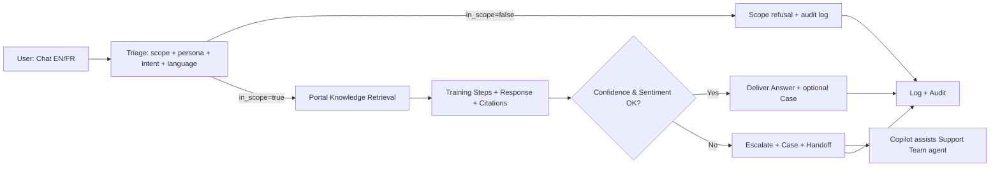
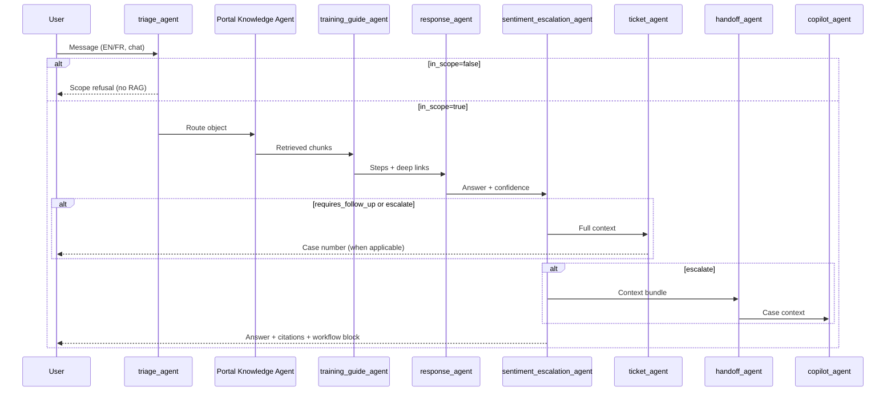

# Multi-Agent Customer Support Crew: Product Requirements Document

**Capstone Project:** Multi-Agent Customer Support Crew  
**Pilot Domain:** CAI (Claim for Insurance) — NYC auto insurance health claims support  
**Primary Knowledge Source:** [CAIInfo.ca](https://www.CAIinfo.ca/)  
**Selected Runtime:** `AAMAD_TARGET_RUNTIME=crewai`  
**Primary Input:** `project-context/1.define/mrd.md` (locked 2026-06-06)  
**Document Status:** Complete (v1.1) — synced with SAD v1.1; ready for Phase 2 build handoff  
**Author Persona:** @product.mgr

---

## Document Control

| Field | Value |
|-------|-------|
| **Version** | 1.1 (synced with SAD v1.1 — stakeholder feedback) |
| **Template** | `.cursor/templates/prd-template.md` |
| **Downstream Consumers** | @system.arch (SAD), @project.mgr, @backend.eng, @frontend.eng, @integration.eng, @qa.eng |
| **Traceability** | All features map to MRD §1–5; agent crew to MRD §2.2; KPIs to MRD §3.4; SAD v1.1 alignment |

---

## 1. Executive Summary

### 1.1 Problem Statement (MRD-Backed)

NYC’s **Claim for Insurance (CAI)** platform is mandatory for transmitting standardized NYC Claim Forms (OCFs) between health care facilities and auto insurers. [CAIInfo.ca](https://www.CAIinfo.ca/) is the authoritative information resource, organized across three persona portals: **Health Care Facilities**, **Insurers**, and **Practice Management Software (PMS) Vendors**.

**Who is affected:** Facility administrators, clinical/admin staff, insurer adjusters, PMS integrators, and new CAI users (MRD §Problem Statement, §1.2).

**What goes wrong:** Users struggle to locate accurate, actionable guidance without time-consuming manual search or full video consumption (MRD Pain Point #1, #2).

**Impact:** Slower enrolment, incorrect OCF submissions, rework on adjudication, increased support tickets, and user frustration (MRD §Problem Statement).

**Pilot goal:** Prove a CrewAI multi-agent crew can answer CAI user questions, map workflows and impacted areas, create ServiceNow Cases, cite CAIInfo.ca sources, and escalate to humans with context (MRD §Problem Statement).

### 1.2 Solution Overview

The **Multi-Agent Customer Support Crew** delivers domain-specific, citation-grounded support for CAI stakeholders via **web chat** (P0), in **English and French**. A sequential CrewAI crew executes: triage (with scope classification) → portal-specialized retrieval → step extraction → response composition (with tone/scope guardrails) → sentiment/confidence gating → conditional ServiceNow Case creation → human handoff and internal copilot assistance. **Azure Speech voice (F9) is deferred to post-pilot** to reduce MVP integration complexity (SAD v1.1).

**Unique value proposition (MRD §5.1):**

> *Ask CAI in plain language—get the answer, the official source, the workflow impact, and a support ticket if you need follow-up.*

**Key differentiators vs. alternatives (MRD §1.5–1.6):**

| Differentiator | vs. Status Quo (CAIInfo.ca) | vs. Generic LLM Chatbot |
|----------------|------------------------------|-------------------------|
| Conversational, persona-aware discovery | Static search + videos | N/A |
| Mandatory citation-backed answers | User interprets alone | Hallucination risk on OCF rules |
| Workflow + impacted-area mapping | Implicit in long guides | Ad hoc |
| Action closure via ServiceNow Case | Separate support channel | No structured ticket pipeline |
| Human-in-the-loop + copilot | Phone/email fragmentation | Opaque escalation |
| Audit-first architecture | Fragmented support logs | Full session → source → Case trace from day 1 (**F10**) |

### 1.3 Strategic Rationale

**Why multi-agent (MRD §1.6, §5.2):** CAI support spans distinct personas, regulated content, bilingual delivery, ticket routing, and escalation logic. A monolithic bot cannot reliably enforce retrieval-only grounding, portal-specific routing, structured Case fields, and audit trails. Specialized agents with explicit task chaining reduce cross-portal retrieval noise and improve ticket quality.

**Business case (pilot):** Reduce CAIInfo.ca navigation friction for new enrollees, adjuster trainees, and PMS integrators; demonstrate ≥80% grounded answer rate and ≥90% citation accuracy on an Support Team SME–validated golden set (MRD §3.4).

**Market timing:** CAI is mandatory for specified OCF transmission; FSRA-governed workflows evolve; GenAI enables citation-grounded self-service without replacing human adjudication (MRD §Problem Statement).

### 1.4 Scope Boundaries (Critical)

| In Scope (MVP / Pilot) | Out of Scope |
|------------------------|--------------|
| Information assistance grounded in public CAIInfo.ca content | Live **CAI production application** integration (MRD Assumption #12) |
| ServiceNow **Case** creation via Table API | FSRA/Support Team **adjudication** or official policy interpretation |
| **Chat-only** web UI (P0) | **Azure Speech voice (F9)** — deferred to post-pilot (SAD v1.1) |
| EN + FR (native FR pages + on-demand EN→FR translation) | Full omnichannel (email bot, SMS, social) |
| Agent copilot for Support Team support staff (human approves all outbound) | Autonomous AI replies to users without human review on escalations |
| Full-site public CAIInfo.ca crawl + scheduled re-index | Proprietary/internal Support Team documents not on CAIInfo.ca |
| **Audit-first** minimal audit trail (F10 P0); content scope & tone guardrails (**F14**) | Out-of-CAI-scope, political, or off-topic generative responses |
| HIPAA-primary compliance; Canada residency for stored artifacts | Production SLA hardening, autoscaling (post-pilot) |
| | Locales beyond EN/FR |

**Positioning:** Domain-specific **CAI support copilot**—not a replacement for Support Team adjudication or regulatory authority (MRD §Critical Decision Points).

---

## 2. Market Context & User Analysis

### 2.1 Target User Segments (From MRD §1.2)

| Persona ID | Role | Primary Goals | MRD Segment |
|------------|------|---------------|-------------|
| **P-FAC-ADMIN** | Facility Administrator | Enrol facility, manage users, submit OCF-18/23/Form 1 | Health Care Facilities portal |
| **P-FAC-USER** | Clinical/Admin Staff | Submit/track OCFs, confirm treatment plans | Health Care Facilities portal |
| **P-INS-ADJ** | Insurer Adjuster | Review worklists, approve/deny, communicate decisions | Insurers portal |
| **P-PMS-VENDOR** | PMS Vendor / Integrated Facility | PMS setup, integration, vendor support flows | PMS Vendors portal |
| **P-Support Team-AGENT** | Support Team Support Agent (internal) | Resolve escalated tickets with accurate citations | Internal copilot channel |

**Geographic focus:** NYC auto insurance health claims ecosystem (pilot SAM: Support Team support channels + enrolled facilities/insurers in partner pilot — MRD §1.4).

### 2.2 Validated Pain Points & Feature Traceability

| MRD Pain Point | User Segments Affected | Product Features That Address It |
|----------------|------------------------|----------------------------------|
| **#1 Manual information search** — multi-portal navigation without conversational guidance | All three external personas | **F1** Portal-aware triage & Q&A; **F8** Step-by-step training extraction; **F2** Full-site RAG with portal metadata filters |
| **#2 Video-first learning friction** — critical steps buried in long videos | P-FAC-USER, P-INS-ADJ (trainees) | **F8** Training Guide Agent step lists + deep links; **F1** Cited answers with page/section URLs |
| **#3 (Derived) No single action path** — fragmented question → answer → ticket → human follow-up | All external personas; P-Support Team-AGENT | **F4** ServiceNow Case automation; **F5/F6** Escalation & handoff; **F7** Copilot with context bundle |
| **Market gap: Answer trust** — users interpret content alone | All external personas | **F1** Mandatory citations; **F10** Audit trail; confidence gating (**F5**) |
| **Market gap: Workflow clarity** — implicit in long guides | P-FAC-ADMIN, P-INS-ADJ | **F1** Workflow/impact block in every answer |
| **Market gap: Voice + bilingual parity** | All external personas (FR-CA users) | **F3** EN/FR UI and responses; **F9** Azure Speech voice (**post-pilot**) |

### 2.3 User Journey Summary (MRD §3.1)

**Adoption barriers (MRD §4.2, Risk Matrix):** User trust in AI for regulated domain; hallucination fear; PHI concerns. **Mitigations:** Prominent source links, human handoff path, AI disclosure, PHI minimization in UI copy, regulated ambiguity disclaimers.

### 2.4 Competitive Context (MRD §1.5)

Pilot competes with **status quo** (CAIInfo.ca search/videos) and **generic AI** (site search, single LLM bots, enterprise CSM AI without CAI grounding). Win condition: **answer + cite + act** in one conversational flow with persona-aware routing.

---

## 3. Technical Requirements & Multi-Agent Architecture

*Requirements-level architecture for downstream @system.arch and @backend.eng. Low-level design lives in `project-context/1.define/sad.md` (v1.1).*

### 3.0 MVP Design Principles

| Principle | Requirement |
|-----------|---------------|
| **Audit-first architecture** | Every interaction produces a traceable audit record in Phase 1 MVP: session ID, triage classification, retrieval sources, guardrail outcomes, escalation reason, Case linkage (F10 P0). Audit is a build requirement—not post-pilot. |
| **Grounded answers only** | RAG over public CAIInfo.ca; no unsourced OCF guidance |
| **Scope-bound & professional** | No generative response to out-of-CAI-scope, political, or off-topic queries; professional tone enforced (F14) |
| **Chat-only MVP** | Voice (F9) deferred to post-pilot to reduce integration complexity |

### 3.1 CrewAI Framework & Orchestration Requirements

| Requirement | Specification | Rationale |
|-------------|---------------|-----------|
| **Process mode** | Sequential (`Process.sequential`) | Deterministic MVP pipeline; reproducible audit (MRD §2.1; adapter-crewai) |
| **Delegation** | `allow_delegation=false` for all agents | Explicit routing via triage JSON; no mid-run mode switches |
| **Memory** | `memory=false` at crew level | Session context passed via task inputs (max 10 turns) |
| **Config externalization** | `config/agents.yaml`, `config/tasks.yaml`, `crew.py` | Change control; adapter-crewai compliance |
| **Execution controls** | `max_iter ≤ 12` per task; `max_retry_limit ≥ 2`; `max_rpm` at crew level | Budget stability (adapter-crewai) |
| **Guardrails** | `Task.guardrail` on `triage_task`, `respond_task`, `ticket_task` | Scope classification, tone validation, citation enforcement, schema validation, output size limits |
| **Prompt Trace** | Captured under `project-context/2.build/logs` for production-facing runs (P1 full per-agent) | Auditability (AAMAD core); minimal audit in P0 (F10) |

### 3.2 Agent Roles, Responsibilities & Interaction Patterns

#### 3.2.1 Agent Catalog

| Agent ID | Role | Goal | Key Tools | Delegation | Memory |
|----------|------|------|-----------|------------|--------|
| `triage_agent` | Intake & portal classifier | Detect language (EN/FR), persona portal, intent, channel, urgency, **CAI scope** | `language_detect`, `intent_classifier`, `scope_classifier`, session reader | false | false |
| `facility_CAI_knowledge_agent` | Facility portal RAG specialist | Retrieve top-k CAIInfo.ca chunks for Facilities portal only | `vector_search`, `citation_formatter` | false | false |
| `insurer_CAI_knowledge_agent` | Insurer portal RAG specialist | Retrieve top-k chunks for Insurers portal only | `vector_search`, `citation_formatter` | false | false |
| `training_guide_agent` | Procedural step extractor | Convert retrieved procedures into numbered steps; videos supplementary only | `step_extractor`, `deep_link_builder` | false | false |
| `response_agent` | User-facing answer composer | Compose cited answer + workflow/impact block; FR translation; **scope & tone validation** | `llm_compose`, `translate_en_to_fr`, `confidence_scorer`, `pii_scrubber`, `scope_validator`, `tone_validator` | false | false |
| `sentiment_escalation_agent` | Quality & escalation gate | Evaluate user sentiment and answer confidence; set escalate/priority flags | `sentiment_analyzer`, `escalation_rules_engine` | false | false |
| `ticket_agent` | ServiceNow Case creator | Create Case with portal routing, category, suggested resolution, citations | `servicenow_case_api` | false | false |
| `handoff_agent` | Human context packager | Produce context bundle for Support Team support agents | `context_summarizer` | false | false |
| `copilot_agent` | Internal support assistant | Suggest replies from same RAG pipeline; **never auto-send** | `vector_search`, `llm_compose`, `servicenow_case_read`, `servicenow_case_write` | false | false |

**PMS vendor routing (MVP):** Triage maps `portal=pms_vendors`; retrieval uses shared vector index with metadata filter `pms_vendors`. Dedicated third knowledge agent is **post-pilot** unless golden-set eval shows retrieval noise (MRD §2.2).

**Compliance filter (MRD §2.2, §3.1):** PHIPA-oriented PII scrubbing and anti-hallucination verification are **required behaviors** implemented via `response_agent` tools + `respond_task` guardrails (compare composed text to retrieved chunks; block if unsupported claims detected). May be promoted to standalone agent post-pilot if guardrails insufficient.

#### 3.2.2 Agent Backstory Context (Domain Grounding)

Each agent backstory MUST reference: (a) CAI/NYC auto insurance claims context, (b) CAIInfo.ca as sole authoritative source for external answers, (c) prohibition on adjudication or eligibility assertions without human confirmation, (d) FSRA/Support Team governance awareness without claiming policy authority.

#### 3.2.3 Interaction Pattern — Sequential Task Pipeline

| Order | Task ID | Agent(s) | Depends On | Primary Output |
|-------|---------|----------|------------|----------------|
| 1 | `triage_task` | `triage_agent` | — | `{ portal, language, intent, channel, urgency, in_scope, scope_rejection_reason }` |
| 2 | `retrieve_task` | Portal knowledge agent | triage | `{ chunks[], citations[], retrieval_score }` |
| 3 | `training_task` | `training_guide_agent` | retrieve | `{ steps[], deep_links[] }` |
| 4 | `respond_task` | `response_agent` | training | `{ answer, citations, workflow_map, confidence, translated_from_en }` |
| 5 | `sentiment_task` | `sentiment_escalation_agent` | respond | `{ escalate, priority, requires_follow_up }` |
| 6 | `ticket_task` | `ticket_agent` | sentiment (conditional) | `{ case_number, assignment_group }` |
| 7 | `handoff_task` | `handoff_agent` | sentiment (if escalate) | `{ handoff_bundle }` |
| 8 | `copilot_task` | `copilot_agent` | handoff / Case open | `{ suggested_reply, citations }` (internal) |

**Conditional branches:**

- **Out-of-scope query:** Triage sets `in_scope=false` (not CAI/NYC auto insurance health claims, political content, abusive/off-topic) → **no RAG, no generative answer** → polite scope refusal + audit log; optional Case if user requests human follow-up (F14).
- **Manual escalation:** User selects **“Talk to a human”** → API Gateway short-circuits RAG (`skip_rag=true`) → `ticket_task` → `handoff_task` → optional `copilot_task`.
- **Retrieval failure:** Zero chunks or index unavailable → block OCF guidance → `requires_follow_up=true`, `escalate=true` → Case created → user message: *“I cannot find authoritative CAIInfo.ca guidance—creating a Case for Support Team support.”*
- **Confidence gate:** `confidence < 0.7` (default) → `escalate=true`; must not fabricate OCF rules.

**Context passing:** Each task receives structured JSON from prior tasks via `Task.context`; no implicit crew memory.

#### 3.2.4 Content, Scope & Tone Guardrails (F14 — see §4)

All user-facing and copilot-suggested text MUST pass guardrails before delivery:

| Guardrail | Rule | On Violation |
|-----------|------|--------------|
| **CAI scope** | Query must relate to CAI, NYC auto insurance health claims, OCF workflows, or supported persona portals | **No answer generated** — scope refusal message only |
| **No political commentary** | Block political opinions, partisan content, or policy advocacy unrelated to neutral CAI procedural guidance | **No answer generated** — no engagement with political framing |
| **Professional language** | Neutral, professional, support-appropriate tone; no slang, sarcasm, or inflammatory language | Block delivery; regenerate once; escalate if still failing |
| **Grounding** | No OCF/regulatory guidance without retrieved CAIInfo.ca support | Block + escalate |
| **PII** | Scrub names, health card numbers from outbound text | `pii_scrubber` before delivery |

**Audit fields (required):** `in_scope`, `scope_rejection_reason`, `guardrail_blocked`, `guardrail_rule_id`, `tone_check_passed`.

### 3.3 Integration Requirements

| Integration | Purpose | Priority | Auth | Residency / Compliance |
|-------------|---------|----------|------|------------------------|
| **CAIInfo.ca full-site indexer** | RAG corpus; portal + language metadata; `last_crawled_at` | P0 | None (public crawl) | Chunks/embeddings stored **Canada** |
| **Vector store** (ChromaDB self-hosted **or** pgvector / Azure AI Search on Azure Canada) | Semantic search with metadata filters; **Canada-only hosting** | P0 | API key / local | **Canada**; **accuracy gate applies** (see F2) |
| **OpenAI managed API** | LLM for agents; embeddings for indexer; EN→FR chunk translation | P0 | API key; **BAA required** | Inference may be cross-border; durable artifacts **Canada only** |
| **ServiceNow Case** (Table API) | Create/read Cases; portal assignment groups | P0 | OAuth or basic (sandbox) | Encrypt in transit; minimize PHI |
| **Web Chat UI** | Customer-facing channel | P0 | Session token / API key (pilot) | WCAG 2.1 AA target |
| **Azure Speech** (Canada) | STT/TTS EN-CA, FR-CA | **Post-pilot (F9)** | Azure key | **Processed in Canada** when implemented |
| **Audit / logging store** | Session → citations → Case linkage; guardrail outcomes; Prompt Trace | P0 (minimal audit-first); P1 (full per-agent) | RBAC | **Canada**; 90-day pilot retention |

**Phased integration order:** CAIInfo.ca index + chat → ServiceNow → *(voice deferred post-pilot)*.

**Vector store selection (Week 1 spike):** Evaluate **ChromaDB** (in-house, self-hosted in Azure Canada) against a fallback (pgvector or Azure AI Search). **Adopt ChromaDB only if** golden-set eval meets KPI-2 (≥90% citation accuracy), retrieval hit rate, and p95 latency < 2s. If ChromaDB underperforms → select best-performing Canada-hosted option (SAD §4.2.1).

**Environment variables (minimum):** `OPENAI_API_KEY`, `SN_INSTANCE`, `SN_USER`, `SN_PASSWORD` or OAuth equivalents, `SN_GROUP_FACILITIES`, `SN_GROUP_INSURERS`, `SN_GROUP_PMS`, `CHROMA_HOST` / vector store connection strings. `AZURE_SPEECH_*` deferred until post-pilot (F9). Document all in `.env.example` — no secrets in artifacts.

### 3.4 ServiceNow Case Field Mapping

| Crew Output | ServiceNow Case Field |
|-------------|----------------------|
| User query + AI answer | `short_description`, `description` |
| Persona portal | `category` / custom field |
| Language (EN/FR) | Custom field |
| Workflow + impacted areas | Work notes / custom field |
| CAIInfo.ca citations | Work notes |
| Suggested resolution | Work notes / `close_notes` draft |
| Escalation / portal | Priority, `assignment_group` |

**Portal routing (illustrative — sandbox sys_ids configured in Phase 1):**

| Portal | Assignment Group | Category (illustrative) |
|--------|------------------|-------------------------|
| Health Care Facilities | `CAI - Facilities Support` | Facility enrolment / OCF submission / admin |
| Insurers | `CAI - Insurers Support` | Adjuster workflow / adjudication / admin |
| PMS Vendors | `CAI - PMS Vendor Support` | PMS integration / vendor setup / technical |

**Case creation policy:** Cases created only when `requires_follow_up=true` **OR** `escalate=true` — **not** on every successful Q&A (see F4).

### 3.5 Infrastructure Requirements (Pilot)

| Component | Specification |
|-----------|---------------|
| **Cloud** | Azure **Canada** region (Canada Central or Canada East) |
| **Compute** | Containerized CrewAI backend + API gateway + chat frontend; 1–2 backend replicas |
| **Concurrency** | ≥ 20 concurrent sessions (pilot) |
| **Indexer** | Scheduled full-site re-crawl (weekly minimum) |
| **Monitoring** | Retrieval hit rate, citation coverage, escalation rate, Case API success, token usage, **guardrail block rate** |
| **Budget** | Free/low-cost OpenAI tiers acceptable for MVP (MRD Resolved Decisions); Azure Speech budget deferred with F9 |

---

## 4. Functional Requirements

Features use **P0** (MVP must-have), **P1** (pilot polish — not in MVP if deferred), **P2** (post-pilot). **F9 voice** moved to post-pilot per v1.1. Each includes user story, acceptance criteria, MRD traceability, and market problem solved.

---

### F1 — Portal-Aware Citation-Grounded Q&A (P0)

**User story:** As a **Facility Administrator** (P-FAC-ADMIN), I want to ask CAI questions in plain language and receive answers with official source links and workflow context, so I can act without manually searching CAIInfo.ca.

**Acceptance criteria:**
- [ ] Triage classifies portal (facilities / insurers / pms_vendors), language, intent, channel, and **CAI scope (`in_scope`)** with structured JSON output.
- [ ] Knowledge retrieval applies portal metadata filter; facility and insurer agents use distinct retrieval prompts.
- [ ] Every delivered answer includes ≥1 canonical CAIInfo.ca URL citation supporting the guidance.
- [ ] Every answer includes **workflow/impact block**: `workflow`, `impacted_ocf`, `portal`, `role`, `suggested_next_action`.
- [ ] Responses generated **only** from retrieved chunks; if retrieval empty → escalation path (§6.2), no fabricated OCF rules.
- [ ] `confidence` score attached; if `< 0.7` → escalate per F5.
- [ ] Regulated ambiguity (eligibility, licensing) returns citations + disclaimer: *“Information assistance only; confirm with Support Team for eligibility or adjudication decisions.”*

**MRD traceability:** Pain #1, #2; Market gaps Discovery, Answer trust, Workflow clarity; §2.2 agent crew.  
**Solves:** Manual multi-portal search; lack of packaged trustworthy answers.

---

### F2 — Full-Site CAIInfo.ca RAG & Content Freshness (P0)

**User story:** As an **Insurer Adjuster** (P-INS-ADJ), I want answers grounded in current CAIInfo.ca content across all public pages, so I trust the guidance reflects official procedures.

**Acceptance criteria:**
- [ ] Indexer crawls **all public pages** across Facilities, Insurers, and PMS Vendors portals.
- [ ] Chunks tagged with: `portal`, `url`, `language` (en/fr native), `last_crawled_at`, section title where extractable.
- [ ] Scheduled re-index job runs at least weekly; UI displays source `last_crawled_at` on answer cards.
- [ ] Vector search supports metadata filters for portal and language.
- [ ] **Week 1 vector store eval:** ChromaDB (primary candidate) tested against fallback; final store selected only if citation accuracy (KPI-2 ≥ 90%) and retrieval hit rate meet targets on golden set (SAD §4.2.1).
- [ ] All embeddings and chunks stored in **Canada** only.

**MRD traceability:** Resolved Decisions (full-site crawl); §2.3 CAIInfo.ca indexer; Risk: stale content.  
**Solves:** Scattered documentation; stale self-service content.

---

### F3 — Bilingual English & French Support (P0)

**User story:** As a **French-speaking facility user**, I want to interact in French and receive grounded answers, so I have parity with English self-service.

**Acceptance criteria:**
- [ ] UI language selector EN/FR (or auto-detect with override).
- [ ] Triage sets `language` field; responses delivered in user’s language.
- [ ] Native FR CAIInfo.ca chunks preferred when available.
- [ ] When user requests FR and only EN content retrieved: translate **retrieved chunks only** at response time; cite **original EN source URL**; set `translated_from_en=true`; display translation badge in UI.
- [ ] ≥80% correct-language grounded answers on FR golden subset (MRD §3.4).

**MRD traceability:** Resolved Decisions (languages, FR strategy); §2.4 bilingual rules.  
**Solves:** EN-heavy web self-service; bilingual parity gap.

---

### F4 — ServiceNow Case Automation (P0)

**User story:** As a **PMS Vendor** (P-PMS-VENDOR), I want a support Case created when I need follow-up, with my question, AI summary, and source links, so Support Team can continue without me repeating context.

**Acceptance criteria:**
- [ ] Ticket agent creates ServiceNow **Case** (not Incident) via Table API.
- [ ] Case includes: user query, AI answer (if any), portal category, language, workflow map, citations, suggested resolution, escalation reason.
- [ ] `assignment_group` and `category` set per portal routing table (§3.4).
- [ ] Case created when `requires_follow_up=true` OR `escalate=true` per decision table below — **not** on every query.
- [ ] User receives Case number confirmation in chat when Case created.
- [ ] 100% valid Case creation on flows requiring follow-up (MRD §3.4 KPI).

**`requires_follow_up` decision table:**

| Condition | `requires_follow_up` | `escalate` | Case? | Priority |
|-----------|---------------------|------------|-------|----------|
| User clicks **“Talk to a human”** | true | true | Yes | High |
| `confidence < 0.7` | true | true | Yes | High |
| Negative sentiment | true | true | Yes | High |
| RAG zero results / index down | true | true | Yes | High |
| Regulated ambiguity — human confirmation recommended | true | false | Yes | Normal |
| User requests follow-up / callback | true | false | Yes | Normal |
| Successful Q&A; no follow-up signal | false | false | **No** | — |

**MRD traceability:** Pain #3; §2.3 ServiceNow; Resolved Decisions (Case table, portal routing).  
**Solves:** Fragmented support channels; no action closure from self-service.

---

### F5 — Sentiment & Confidence Escalation (P0)

**User story:** As an **Support Team Support Agent** (P-Support Team-AGENT), I want frustrated or low-confidence interactions escalated automatically, so I can intervene before users receive unsafe guidance.

**Acceptance criteria:**
- [ ] Sentiment agent evaluates user tone and model confidence on every interaction.
- [ ] Escalation rules engine evaluates conditions in documented order (manual handoff → retrieval failure → low confidence → negative sentiment → regulated ambiguity).
- [ ] Escalation sets Case priority appropriately; includes escalation reason in Case work notes.
- [ ] ≥80% escalation appropriateness on pilot eval rubric (MRD §3.4).

**MRD traceability:** §3.3 Human-in-the-loop; §2.5 hallucination mitigation.  
**Solves:** Unsafe auto-responses; undetected user frustration.

---

### F6 — Human Handoff with Context Bundle (P0)

**User story:** As an **Support Team Support Agent**, I want a summary of the conversation, retrieved sources, and suggested resolution when a session escalates, so I can resume efficiently.

**Acceptance criteria:**
- [ ] Handoff agent produces bundle: user query history (≤10 turns), triage classification, citations, workflow map, confidence, escalation reason, Case ID.
- [ ] Manual **“Talk to a human”** bypasses RAG; creates high-priority Case with user query; confirms: *“A support Case has been created; an Support Team agent will follow up via your Case [number].”*
- [ ] Copilot UI receives handoff bundle on Case open.

**MRD traceability:** §3.3; Pain #3.  
**Solves:** Incomplete context on escalations; repetitive FAQ handling.

---

### F7 — Support Team Agent Copilot (P0)

**User story:** As an **Support Team Support Agent**, I want AI-suggested replies grounded in the same CAIInfo.ca retrieval pipeline, so I respond faster while maintaining accuracy.

**Acceptance criteria:**
- [ ] Copilot suggests reply + citations from same RAG pipeline as customer channel.
- [ ] Support Team agent **must** review and click **Approve/Send** — no autonomous outbound messages.
- [ ] Approved text posted to ServiceNow Case **work notes** via Table API.
- [ ] RBAC: copilot endpoints accessible only to internal role.
- [ ] API: `POST /internal/copilot/cases/{case_id}/suggest` and `POST /internal/copilot/cases/{case_id}/send`.
- [ ] In-chat push of human reply to active session: **P1 nice-to-have** (does not block demo).

**MRD traceability:** §2.2 Copilot Agent; §3.3 copilot mode; §1.6 differentiator #4.  
**Solves:** Repetitive FAQ tickets; slow human response drafting.

---

### F8 — Training Step Extraction & Deep Links (P0)

**User story:** As **Clinical/Admin Staff** (P-FAC-USER), I want step-by-step instructions extracted from CAI procedures without watching full training videos, so I can complete tasks faster.

**Acceptance criteria:**
- [ ] Training guide agent produces numbered steps from retrieved procedural content.
- [ ] Each step includes deep link to relevant CAIInfo.ca page/section where possible.
- [ ] Videos referenced only as supplementary (“see also video …”), not required to consume for answer validity.
- [ ] ≥85% workflow accuracy on scripted scenarios (MRD §3.4).

**MRD traceability:** Pain #2; §2.2 Training Guide Agent.  
**Solves:** Video-first learning friction.

---

### F9 — Azure Speech Voice Channel (Post-Pilot — was P1, deferred per SAD v1.1)

**Priority change:** Deferred from MVP to **post-pilot** to reduce integration complexity. Chat MVP must meet KPI targets before F9 begins.

**User story:** As a **Facility Administrator** on a phone or hands-free context, I want to speak my CAI question and hear the cited answer, so I can use the same crew without typing.

**Acceptance criteria:**
- [ ] Azure Speech SDK in **Canadian region**; locales EN-CA, FR-CA.
- [ ] Voice input → same CrewAI backend pipeline as chat → TTS output.
- [ ] Graceful degradation: if voice quota exceeded, inform user and offer chat-only.
- [ ] Delivered **after** chat + ServiceNow KPIs met on MVP demo.

**MRD traceability:** Resolved Decisions (Azure Speech Canada); §2.3 voice stack.  
**Solves:** Web-only self-service limitation.

---

### F10 — Audit Trail & Prompt Trace (P0 audit-first → P1 full)

**User story:** As a **pilot sponsor / compliance reviewer**, I want an auditable trail linking sessions, sources, guardrail outcomes, and Cases, so I can review AI-assisted support decisions.

**Acceptance criteria:**
- [ ] **Phase 1 (P0 — audit-first):** Log session ID, portal, triage classification, citations, guardrail outcomes (`in_scope`, `scope_rejection_reason`, `guardrail_blocked`), Case number, escalation reason, timestamp — redacted, stored in Canada. **Ships with MVP—not optional.**
- [ ] **Phase 2 (P1):** Full per-agent Prompt Trace under `project-context/2.build/logs` with secrets/PHI redacted.
- [ ] Audit records retained 90 days (pilot default); deletion by `session_id` supported.

**MRD traceability:** §1.6 differentiator #5 Auditability; §4.2 access control; SAD v1.1 audit-first principle.  
**Solves:** Opaque AI decisions in regulated domain.

---

### F14 — Content Scope & Tone Guardrails (P0)

**User story:** As an **Support Team Support Agent**, I want the system to refuse out-of-scope or inappropriate queries and maintain professional language, so users receive only trustworthy CAI-focused assistance.

**Acceptance criteria:**
- [ ] `scope_classifier` in triage sets `in_scope` flag; pipeline stops before RAG when `in_scope=false`.
- [ ] Out-of-CAI-scope queries receive **no generative answer** — only polite refusal: *“I can only assist with CAI and NYC auto insurance health claims topics…”*
- [ ] Political or partisan queries blocked with **no engagement** — same refusal path.
- [ ] `tone_validator` on `respond_task` enforces professional language; blocks slang, sarcasm, inflammatory content.
- [ ] Copilot suggestions subject to same scope and tone rules.
- [ ] Golden set includes **negative test cases** (off-topic, political) verifying zero unsourced generative responses.
- [ ] All guardrail events logged in audit trail (F10).

**MRD traceability:** §2.5 hallucination mitigation; SAD v1.1 §2.4.  
**Solves:** Off-topic/harmful responses; unprofessional tone in regulated support context.

---

### F11 — Proactive Content Change Alerts (P2 — Post-Pilot)

**User story:** As **Support Team operations**, I want alerts when CAIInfo.ca changes affect open Cases, so agents can proactively update guidance.

**Acceptance criteria:** Deferred. Document as future work in UI/docs when referenced.

**MRD traceability:** §5.3 Future Extensions.

---

### F12 — Live CAI Application Integration (P2 — Out of Scope)

**Explicitly excluded** from MVP. Informational support + ServiceNow Cases only (MRD Assumption #12).

---

### F13 — FAQ Analytics Dashboard (P2 — Post-Pilot)

**User story:** As **Support Team leadership**, I want FAQ theme analytics by portal and language, so we can improve CAIInfo.ca content and training.

**Acceptance criteria:** Deferred post-pilot.

**MRD traceability:** §5.3 Future Extensions.

---

## 5. Non-Functional Requirements

### 5.1 Performance

| Metric | Target | Source |
|--------|--------|--------|
| Chat first response (median, excl. STT) | < 15 seconds | MRD §3.4 |
| RAG retrieval latency (p95) | < 2 seconds | SAD alignment |
| ServiceNow Case create (p95) | < 3 seconds | SAD alignment |
| Concurrent sessions (pilot) | ≥ 20 | MRD pilot scope |
| Session context window | ≤ 10 turns | Token/cost control |
| Availability (demo window) | 99% | Pilot SLA |

### 5.2 Security & Compliance

| Requirement | Specification |
|-------------|---------------|
| **HIPAA (primary)** | OpenAI **BAA required**; PHI minimization in prompts and Cases; vendor BAAs as applicable |
| **Canadian data residency** | Logs, embeddings, audit store **within Canada**; Azure Speech when F9 implemented |
| **PHIPA / PIPEDA** | Jurisdictional secondary note; document in SAD |
| **Encryption** | TLS 1.2+ in transit; AES-256 at rest for logs and Case-related storage |
| **RBAC** | End-user chat vs internal copilot roles |
| **PII handling** | UI discourages PHI entry; `pii_scrubber` on responses; log redaction |
| **AI transparency** | Disclose AI assistance; badge `translated_from_en` content |
| **Grounding rule** | No OCF guidance without retrieval support |
| **Scope & tone guardrails** | No response outside CAI scope; no political commentary; professional language only (F14) |
| **Human adjudication** | AI never adjudicates claims or asserts definitive eligibility (MRD Assumption #10) |

### 5.3 Scalability & Degradation

| Scenario | Required Behavior |
|----------|-------------------|
| OpenAI/Azure quota exceeded | Queue/throttle; user-friendly message; no silent failure |
| RAG index unavailable | **No** generative OCF answers; create escalation Case only |
| Out-of-scope / political query | **No** generative answer; scope refusal + audit log (F14) |
| Autoscaling | **Not required** for MVP |

### 5.4 Observability & Quality Gates

| Signal | Action |
|--------|--------|
| Retrieval hit rate | Log per query; alert if golden-set hit rate < 90% |
| Missing citation | Block response delivery |
| Case API errors | Retry ≥2; alert if error rate > 1% |
| Token usage | Per-session aggregate; cap approaching free tier |
| Guardrail block rate | Log scope/tone/citation blocks; review in golden-set QA |
| Golden set validation | Support Team SME validates 30–40 questions before evaluator demo; includes negative scope cases |

---

## 6. User Experience Design

### 6.1 Chat Interface Requirements (MVP — Chat-Only)

**Chat UI (P0):**

| Element | Requirement |
|---------|-------------|
| Language | EN/FR selector or auto-detect with override |
| Portal hint | Optional user override for persona portal (Facilities / Insurers / PMS) |
| AI disclosure | Visible notice that responses are AI-assisted |
| Regulated disclaimer | Information assistance only; not adjudication |
| Answer card | Answer text, citation links (clickable), workflow/impact block, `last_crawled_at`, translation badge if applicable |
| Case confirmation | Display Case number when created |
| Human handoff | Prominent **“Talk to a human”** control — always visible |
| PHI guidance | Inline copy discouraging entry of names, health card numbers |
| Scope refusal | Clear message when query is out of CAI scope; no partial/off-topic answer shown |
| Accessibility | **WCAG 2.1 AA** target |
| Platform | Web application calling backend REST API (+ optional SSE streaming) |

**Voice UI (Post-Pilot — F9):**

| Element | Requirement |
|---------|-------------|
| Input | Push-to-talk or voice activity detection (implementation choice for @frontend.eng) |
| Output | TTS reads answer; citations available in companion chat transcript |
| Locales | EN-CA, FR-CA |
| Timing | Implement only after chat MVP KPIs validated |

**Copilot UI (P0 — internal):**

| Element | Requirement |
|---------|-------------|
| Case context | Show handoff bundle, citations, user history |
| Suggested reply | Editable draft from copilot agent |
| Actions | **Approve/Send** only — no auto-send |
| Audit | Log who approved and when |

### 6.2 Error, Escalation & Empty-State UX

| Scenario | User-Facing Message / Behavior |
|----------|-------------------------------|
| Retrieval failure | *“I cannot find authoritative CAIInfo.ca guidance—creating a Case for Support Team support.”* + Case number |
| Low confidence escalation | Partial cited answer if chunks exist + Case + human follow-up notice |
| Manual human request | Case created; no AI OCF guidance unless user also asked question in same message |
| Regulated ambiguity | Answer with citations + eligibility disclaimer + Case if follow-up needed |
| API/system error | Apologetic message; offer retry or human handoff; no fabricated guidance |
| Rate limit | Inform user of delay; preserve session |
| Out-of-scope / political query | *“I can only assist with CAI and NYC auto insurance health claims topics. For other questions, please contact Support Team support or select ‘Talk to a human’.”* — no generative answer |

### 6.3 Agent Interaction Design Principles

- **Audit-first:** Every interaction logged with sources and guardrail outcomes from MVP launch (F10).
- **Transparency:** Always show sources; never hide that AI assisted.
- **Explainability:** Workflow/impact block makes “what this affects” explicit.
- **Control:** User can always request human; escalation never blocked by AI refusal to create Case.
- **Professionalism:** Scope-bound responses only; no political or off-topic engagement (F14).
- **Feedback:** Optional thumbs up/down on answers (P1 nice-to-have) for golden-set expansion.

---

## 7. Success Metrics & Validation Criteria

### 7.1 Pilot KPIs (MRD §3.4 — Primary Validation)

| KPI ID | Definition | Target | Validation Method |
|--------|------------|--------|-------------------|
| **KPI-1** | Query answer rate (% receiving grounded response) | ≥ 80% | Golden set + pilot test queries |
| **KPI-2** | Citation accuracy (sources support answer) | ≥ 90% | Support Team SME review of golden set |
| **KPI-3** | Workflow accuracy (workflow + impacted areas) | ≥ 85% | Scripted scenarios |
| **KPI-4** | Ticket creation validity | 100% on follow-up flows | ServiceNow sandbox verification |
| **KPI-5** | Escalation appropriateness | ≥ 80% precision | Pilot eval rubric |
| **KPI-6** | Bilingual answer rate (FR/EN correct language + citations) | ≥ 80% FR subset | FR golden scenarios |
| **KPI-7** | Time-to-answer (chat median, excl. STT) | < 15 s | Load test / demo instrumentation |

**Golden question set:** 30–40 total (~10–13 per portal), EN + FR scenarios; validated by **Support Team SME** before evaluator demo.

### 7.2 Technical Validation Criteria

- [ ] `crew.kickoff()` completes full sequential pipeline on representative queries per portal.
- [ ] ServiceNow Case created with correct `assignment_group` for each portal in sandbox.
- [ ] Zero-chunk retrieval never produces unsourced OCF guidance.
- [ ] Out-of-scope and political queries never produce generative CAI guidance (F14).
- [ ] ChromaDB vs fallback vector store eval completed; selected store meets KPI-2 on golden set.
- [ ] Copilot cannot send without explicit Approve/Send action.
- [ ] All durable logs/embeddings verified in Canada region.

### 7.3 Go / No-Go Gates (MRD Critical Decision Points)

| Go | No-Go |
|----|-------|
| CAIInfo.ca corpus indexed + ticketing API available | Cannot ground answers or create real Cases |
| Golden set citation accuracy ≥ 90% after SME review | Hallucination rate unacceptable |
| HIPAA + Canada residency design approved | Compliance blockers unresolved |
| CrewAI + integration spike succeeds in Week 1 | Integration exceeds capstone timeline |

---

## 8. Implementation Strategy

### 8.1 Development Phases

| Phase | Timeline | Deliverables | Features |
|-------|----------|--------------|----------|
| **Phase 1 — Core MVP** | Weeks 1–3 | Full-site indexer; vector store eval + deployment (Canada); sequential CrewAI crew; **chat-only** UI; ServiceNow Cases; basic copilot; **audit-first** minimal audit; content guardrails | F1, F2, F3, F4, F5, F6, F7, F8, F10 (minimal), **F14** |
| **Phase 2 — Audit Hardening** | Week 4 | Full per-agent Prompt Trace; re-index automation; guardrail tuning from golden set | F10 (full) |
| **Phase 3 — Post-Pilot** | Deferred | **Azure Speech voice (F9)**; analytics, proactive alerts, production hardening | F9, F11, F13 |

**Module alignment (AAMAD development workflow):**

1. **Module 1 — Core Configuration:** Agent/task YAML, crew kickoff, scope/tone guardrails.
2. **Module 2 — API Integration:** ServiceNow, **ChromaDB eval + vector store**, OpenAI tools.
3. **Module 3 — Frontend Integration:** Chat UI, copilot UI (**no voice adapter in MVP**).
4. **Module 4 — Validation:** Golden set (incl. negative scope cases), E2E, KPI rubric.

### 8.2 Resource Requirements

| Role | Responsibility |
|------|----------------|
| @project.mgr | Environment scaffold, `.env.example`, setup.md |
| @backend.eng | CrewAI crew, tools, indexer, API gateway |
| @frontend.eng | Chat UI, copilot UI, WCAG (**voice client post-pilot**) |
| @integration.eng | ServiceNow adapter, end-to-end flows |
| @qa.eng | Golden set execution, KPI validation, qa.md |
| Support Team SME | Golden question validation (external) |

**Third-party services:** OpenAI (BAA), Azure Canada (hosting, vector), ServiceNow sandbox. Azure Speech deferred with F9.

### 8.3 Risk Mitigation

| Risk | Level | Mitigation |
|------|-------|------------|
| LLM hallucination on OCF rules | High | RAG-only; citations; confidence gate; escalation; scope guardrails (F14) |
| Integration complexity | High | **Chat-only MVP**; voice deferred post-pilot |
| ChromaDB retrieval accuracy | Medium | Week 1 eval vs fallback; reject ChromaDB if KPI-2 not met |
| OpenAI free-tier limits | Medium | gpt-4o-mini; cache; session caps |
| French corpus gaps | Medium | Native FR + chunk translation; SME FR golden set |
| HIPAA + cross-border inference | Medium | BAA; PHI minimization; Canada storage; document flow in SAD |
| Feature creep | Low | Strict P0 gate; F11–F13 deferred |
| Stale CAIInfo.ca content | Medium | Weekly re-index; surface `last_crawled_at` |

---

## 9. Launch & Pilot Strategy

### 9.1 Beta / Pilot Testing Plan

| Activity | Criteria |
|----------|----------|
| **Golden set authoring** | 30–40 questions across portals; EN + FR |
| **SME validation** | Support Team SME signs off on expected answers/sources |
| **Sandbox integration** | ServiceNow Cases land in correct assignment groups |
| **Demo script** | Covers enrolment, OCF submission, adjuster workflow, PMS integration, escalation, copilot |
| **Evaluator demo** | All KPI-1 through KPI-7 measured and recorded |

### 9.2 Pilot Success Criteria (Launch)

- All **P0** features functional in demo environment (F9 voice excluded — post-pilot).
- KPI-2 (citation accuracy) ≥ 90% on SME-validated golden set.
- No unsourced OCF guidance in golden set runs.
- Out-of-scope queries produce no generative CAI content (F14 validated).
- BAA executed before production-facing pilot traffic.
- Audit trail demonstrates session → citations → guardrail outcomes → Case linkage.

### 9.3 Post-Pilot Optimization Priorities

1. **Azure Speech voice channel (F9)** — after chat MVP KPIs validated.
2. Azure OpenAI Canada-only inference if sponsor requires zero cross-border.
3. Dedicated PMS knowledge agent if portal-filter retrieval insufficient.
4. FAQ analytics dashboard (F13).
5. Proactive content change alerts (F11).

---

## 10. Feature-to-Market Problem Traceability Matrix

| Feature | MRD User Segment | MRD Pain / Gap | Market Problem Solved |
|---------|------------------|----------------|----------------------|
| F1 | All external personas | Pain #1; Gaps: Discovery, Trust, Workflow | Eliminates manual multi-portal search; packages trustworthy, actionable answers |
| F2 | All external personas | Stale content risk; authoritative source need | Ensures answers reflect full official CAIInfo.ca corpus |
| F3 | All external personas (FR users) | Gap: Voice + bilingual parity | French-speaking users get equivalent grounded self-service |
| F4 | All external personas; P-Support Team-AGENT | Pain #3; Gap: Action closure | Single path from question to tracked Case with context |
| F5 | P-Support Team-AGENT; all users | Hallucination risk; frustration | Prevents unsafe auto-responses; routes frustration to humans |
| F6 | P-Support Team-AGENT | Pain #3; repetitive FAQ | Humans receive complete context; faster resolution |
| F7 | P-Support Team-AGENT | Gap: Answer trust at scale | Speeds human replies while preserving citation grounding |
| F8 | P-FAC-USER, P-INS-ADJ trainees | Pain #2 | Replaces mandatory full-video learning with extracted steps |
| F9 | P-FAC-ADMIN (hands-free) | Gap: Voice + bilingual parity | **Post-pilot** — extends same crew to spoken interaction |
| F10 | Pilot sponsor, compliance | Differentiator #5 Auditability | Enables compliance review of AI-assisted support (audit-first) |
| F14 | All users; P-Support Team-AGENT | Off-topic / trust risk | Blocks out-of-scope and political queries; enforces professional tone |
| F11–F13 | Support Team operations | §5.3 future extensions | Post-pilot operational excellence |

---

## Sources

| # | Source | Use in PRD |
|---|--------|------------|
| 1 | `project-context/1.define/mrd.md` (locked 2026-06-06) | Primary requirements, KPIs, integrations, agent crew, compliance |
| 2 | [CAIInfo.ca](https://www.CAIinfo.ca/) | Domain authority; citation requirements |
| 3 | `.cursor/templates/prd-template.md` | Document structure |
| 4 | `.cursor/rules/adapter-crewai.mdc` | Runtime execution controls |
| 5 | `.cursor/rules/aamad-core.mdc` | Artifact contract, audit, traceability |
| 6 | `AGENTS.md` | Persona handoff boundaries |
| 7 | Stakeholder pilot inputs (2026-06-06) | Resolved decisions per MRD Audit |
| 8 | `project-context/1.define/sad.md` (v1.1, 2026-06-12) | Audit-first, ChromaDB eval, voice deferral, guardrails |
| 9 | Stakeholder feedback (2026-06-12) | MVP scope refinements synced PRD ↔ SAD |

---

## Assumptions

1. MRD locked 2026-06-06 is authoritative for pilot scope; PRD inherits all MRD Assumptions (#1–15).
2. ServiceNow **Case** table and Table API credentials available for capstone pilot.
3. **OpenAI BAA** executed before production-facing pilot; cross-border inference documented in SAD.
4. **Support Team SME** available to validate golden question set before evaluator demo.
5. Full-site **public CAIInfo.ca** crawl only — no proprietary Support Team internal docs.
6. **Free/low-cost** OpenAI and Azure tiers sufficient for MVP demo traffic.
7. Exact ServiceNow sandbox `assignment_group` sys_ids discovered in Phase 1 Week 1 (`SN_GROUP_*` env vars).
8. Chat UI framework choice deferred to @frontend.eng; WCAG 2.1 AA is acceptance target.
9. Compliance filter implemented as response guardrails + PII scrubber unless testing proves need for standalone agent.
10. **ChromaDB** is preferred in-house vector store if Week 1 eval meets KPI-2; otherwise use best-performing Canada-hosted option (SAD §4.2.1).
11. **Voice (F9) deferred to post-pilot** per stakeholder decision; MVP is chat-only.
12. **Audit-first:** minimal audit trail (F10 P0) ships with Phase 1 MVP—not optional.
13. SAD (`project-context/1.define/sad.md` v1.1) elaborates low-level architecture consistent with this PRD; PRD prevails on **what**; SAD on **how**.

---

## Open Questions

| ID | Question | Owner | Target Resolution |
|----|----------|-------|-------------------|
| OQ-1 | ServiceNow sandbox sys_ids for `SN_GROUP_FACILITIES`, `SN_GROUP_INSURERS`, `SN_GROUP_PMS` | @integration.eng | Phase 1 Week 1 |
| OQ-2 | Custom Case fields vs work-notes JSON fallback schema | @integration.eng + sponsor | Phase 1 Week 1 |
| OQ-3 | Sponsor acceptance of cross-border OpenAI inference vs Azure OpenAI Canada mandate | Pilot sponsor | Before Phase 1 crew integration |
| OQ-4 | Dedicated `pms_knowledge_agent` vs portal-filter-only retrieval | @qa.eng after golden set | Post Phase 1 eval |
| OQ-5 | ChromaDB vs pgvector vs Azure AI Search — final selection after Week 1 eval | @backend.eng + @qa.eng | Phase 1 Week 1 |

*All MRD stakeholder discovery questions resolved 2026-06-06; OQ-1–OQ-5 are build-phase implementation details.*

---

## Audit

| Field | Value |
|-------|-------|
| **Timestamp** | 2026-06-12 (v1.1 — synced with SAD v1.1) |
| **Persona** | @product.mgr |
| **Action** | PRD v1.1 sync — audit-first principle, ChromaDB eval gate, F9 voice deferred, F14 guardrails; aligned with `sad.md` v1.1 |
| **Template** | `.cursor/templates/prd-template.md` |
| **Runtime** | `AAMAD_TARGET_RUNTIME=crewai` |
| **Inputs** | `project-context/1.define/mrd.md`, `project-context/1.define/sad.md` (v1.1), stakeholder feedback (2026-06-12) |
| **Outputs** | `project-context/1.define/prd.md` |
| **Traceability** | §2.2 pain-point map; §10 feature matrix; F1–F8, F10, F14 P0; F9 post-pilot; §3 agent catalog + guardrails |
| **Handoff** | Ready for Phase 2 `@project.mgr` *setup-project |
| **Prompt Trace** | Omitted — requirements synced from SAD v1.1 and stakeholder feedback per AAMAD lean artifact policy |
