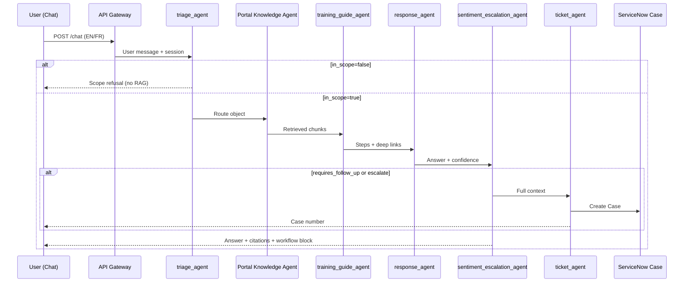
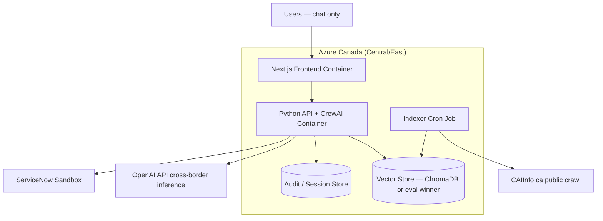

# Multi-Agent Customer Support Crew — MVP System Architecture Document

**Capstone Project:** Multi-Agent Customer Support Crew  
**Pilot Domain:** CAI (Claim for Insurance) — NYC auto insurance health claims support  
**Primary Knowledge Source:** [CAIInfo.ca](https://www.CAIinfo.ca/)  
**Selected Runtime:** `AAMAD_TARGET_RUNTIME=crewai`  
**Document Mode:** MVP (`*create-sad --mvp`)  
**Document Status:** Complete — ready for Phase 2 `@project.mgr` handoff  
**Author Persona:** @system.arch

---

## Document Control


| Field                    | Value                                                                                           |
| ------------------------ | ----------------------------------------------------------------------------------------------- |
| **Version**              | 1.1 (MVP — stakeholder feedback incorporated)                                                   |
| **Template**             | `.cursor/templates/sad-template.md` (adapted for CAI pilot)                                    |
| **Primary Inputs**       | `project-context/1.define/mrd.md` (locked 2026-06-06), `project-context/1.define/prd.md` (v1.0) |
| **Downstream Consumers** | @project.mgr, @backend.eng, @frontend.eng, @integration.eng, @qa.eng                            |
| **Traceability**         | PRD §3 (architecture), §4 (F1–F13), §5 (NFRs); MRD §2–4                                         |


---

## Stakeholders & Concerns (ISO/IEC/IEEE 42010)


| Stakeholder                                                           | Concern                                                    | Architectural Response                                             |
| --------------------------------------------------------------------- | ---------------------------------------------------------- | ------------------------------------------------------------------ |
| **Facility / Insurer / PMS users** (P-FAC-*, P-INS-ADJ, P-PMS-VENDOR) | Fast, trustworthy CAI guidance without manual site search | Portal-aware RAG, mandatory citations, workflow/impact block       |
| **Support Team Support Agent** (P-Support Team-AGENT)                               | Complete escalation context; faster replies                | Handoff bundle + copilot (human approves all outbound)             |
| **Pilot sponsor / compliance reviewer**                               | HIPAA, Canada residency, auditability                      | Canada-only durable storage; BAA; minimal audit trail (F10)        |
| **@backend.eng / @integration.eng**                                   | Deterministic, testable crew pipeline                      | Sequential CrewAI; externalized YAML; structured JSON task outputs |
| **@frontend.eng**                                                     | Accessible chat/copilot UI                                 | REST + optional SSE; WCAG 2.1 AA target                            |
| **Support Team SME**                                                         | Golden-set validation                                      | KPI rubric hooks; citation enforcement guardrails                  |


**Viewpoints:** Logical (agents/tasks), Process (request pipeline), Deployment (Azure Canada), Data (RAG corpus + audit).

---

### 1. MVP Architecture Philosophy & Principles

#### MVP Design Principles


| Principle                      | MVP Implementation                                                                                                                                                                                                                                                                                                                                                         |
| ------------------------------ | -------------------------------------------------------------------------------------------------------------------------------------------------------------------------------------------------------------------------------------------------------------------------------------------------------------------------------------------------------------------------- |
| **Audit-first architecture**   | Every user interaction produces a traceable record: session ID, triage classification, retrieval sources, guardrail outcomes, escalation reason, and Case linkage. Audit logging is a **build-time requirement**, not a post-pilot add-on. Minimal audit (F10 P0) ships with Phase 1; full per-agent Prompt Trace follows in Phase 2 (PRD F10; MRD §1.6 differentiator #5) |
| **Grounded answers only**      | RAG over public CAIInfo.ca; block unsourced OCF guidance (PRD F1, F2; MRD §2.5)                                                                                                                                                                                                                                                                                           |
| **Answer + cite + act**        | Cited response + optional ServiceNow Case when follow-up/escalation required (MRD §5.1)                                                                                                                                                                                                                                                                                    |
| **Human-in-the-loop**          | Escalation paths always available; copilot never auto-sends (PRD F6, F7)                                                                                                                                                                                                                                                                                                   |
| **Scope-bound & professional** | No response to out-of-scope, political, or off-topic queries; professional tone enforced via triage + response guardrails (see §2.4)                                                                                                                                                                                                                                       |
| **Pilot-first complexity**     | **Chat-only MVP**; voice deferred to post-pilot to reduce integration risk (stakeholder decision; supersedes PRD F9 P1 for MVP)                                                                                                                                                                                                                                            |
| **Observable by default**      | Retrieval hit rate, escalation rate, Case API success, token usage, guardrail block rate (PRD §5.4)                                                                                                                                                                                                                                                                        |


#### Core vs. Future Features


| Phase                                    | In Scope                                                                                                                                                                                 | Deferred (Future Work)                                                                         |
| ---------------------------------------- | ---------------------------------------------------------------------------------------------------------------------------------------------------------------------------------------- | ---------------------------------------------------------------------------------------------- |
| **Phase 1 — Core MVP (Weeks 1–3)**       | Full-site indexer; vector store (Canada); sequential CrewAI crew; **chat-only** UI; ServiceNow Cases; basic copilot; **audit-first** minimal audit trail; content guardrails             | —                                                                                              |
| **Phase 2 — Audit & Hardening (Week 4)** | Full per-agent Prompt Trace; guardrail tuning from golden-set eval                                                                                                                       | —                                                                                              |
| **Post-Pilot**                           | **Azure Speech voice (F9)**, FAQ analytics (F13), proactive content alerts (F11), live CAI app integration (F12), dedicated PMS knowledge agent, autoscaling/SLA hardening, omnichannel | Enterprise SSO, production autoscaling, Azure OpenAI Canada-only mandate (if sponsor requires) |


#### Technical Architecture Decisions (MVP)


| Decision          | Choice                                                                                                                                                        | Rationale                                                                                         |
| ----------------- | ------------------------------------------------------------------------------------------------------------------------------------------------------------- | ------------------------------------------------------------------------------------------------- |
| **Orchestration** | CrewAI sequential (`Process.sequential`)                                                                                                                      | Deterministic audit trail; adapter-crewai compliance (PRD §3.1)                                   |
| **Frontend**      | Next.js 14+ App Router + assistant-ui + shadcn/ui + Tailwind                                                                                                  | Production-grade LLM chat UX; streaming; template alignment                                       |
| **Backend**       | Python CrewAI service + FastAPI (or equivalent) API gateway                                                                                                   | Native CrewAI; separate from Next.js for Python tool ecosystem                                    |
| **Vector store**  | **Evaluate in Week 1 spike** — see §4.2.1; ChromaDB (self-hosted Canada) is preferred *if* golden-set retrieval accuracy meets KPI-2 (≥90% citation accuracy) | Portal + language metadata filters; Canada residency mandatory; **accuracy gate before adoption** |
| **Deployment**    | Containerized services on **Azure Canada** (Canada Central/East)                                                                                              | MRD §4.1 residency requirement                                                                    |
| **Real-time**     | SSE streaming for chat responses (optional); sync REST acceptable for MVP demo                                                                                | PRD §6.1 platform note                                                                            |
| **Memory**        | `memory=false`; session context via task inputs (≤10 turns)                                                                                                   | Reproducibility; cost control (PRD §3.1)                                                          |


**Explicit MVP exclusions:** **Azure Speech / voice channel (F9)**; live CAI production integration; autoscaling; FAQ dashboard; email/SMS/social channels; locales beyond EN/FR; autonomous copilot outbound; FSRA adjudication; political or off-topic conversational responses.

---

### 2. Multi-Agent System Specification

#### 2.1 Agent Architecture (MVP Crew)

Nine agents in sequential pipeline; `allow_delegation=false` for all (PRD §3.2.1).


| Agent ID                        | Role                         | Tools (MVP)                                                                                                   | Output                                                                             |
| ------------------------------- | ---------------------------- | ------------------------------------------------------------------------------------------------------------- | ---------------------------------------------------------------------------------- |
| `triage_agent`                  | Intake & portal classifier   | `language_detect`, `intent_classifier`, `scope_classifier`, session reader                                    | `{ portal, language, intent, channel, urgency, in_scope, scope_rejection_reason }` |
| `facility_CAI_knowledge_agent` | Facilities portal RAG        | `vector_search`, `citation_formatter`                                                                         | `{ chunks[], citations[], retrieval_score }`                                       |
| `insurer_CAI_knowledge_agent`  | Insurers portal RAG          | `vector_search`, `citation_formatter`                                                                         | Same schema                                                                        |
| `training_guide_agent`          | Step extractor               | `step_extractor`, `deep_link_builder`                                                                         | `{ steps[], deep_links[] }`                                                        |
| `response_agent`                | Answer composer + guardrails | `llm_compose`, `translate_en_to_fr`, `confidence_scorer`, `pii_scrubber`, `tone_validator`, `scope_validator` | `{ answer, citations, workflow_map, confidence, translated_from_en }`              |
| `sentiment_escalation_agent`    | Quality gate                 | `sentiment_analyzer`, `escalation_rules_engine`                                                               | `{ escalate, priority, requires_follow_up }`                                       |
| `ticket_agent`                  | ServiceNow Case creator      | `servicenow_case_api`                                                                                         | `{ case_number, assignment_group }`                                                |
| `handoff_agent`                 | Context packager             | `context_summarizer`                                                                                          | `{ handoff_bundle }`                                                               |
| `copilot_agent`                 | Internal assistant           | `vector_search`, `llm_compose`, `servicenow_case_read/write`                                                  | `{ suggested_reply, citations }`                                                   |


**PMS routing (MVP):** Triage sets `portal=pms_vendors`; retrieval uses shared index with metadata filter `pms_vendors`. Dedicated third knowledge agent is **post-pilot** unless golden-set eval shows noise (PRD OQ-4).

**Compliance filter (MVP):** Implemented as `response_agent` tools + `respond_task` guardrails (PII scrub, chunk-grounding verification)—not a standalone agent unless guardrails prove insufficient (PRD Assumption #9).

#### 2.2 Task Orchestration


| Order | Task ID          | Agent                        | Condition                                       |
| ----- | ---------------- | ---------------------------- | ----------------------------------------------- |
| 1     | `triage_task`    | `triage_agent`               | Always; **blocks pipeline if `in_scope=false`** |
| 2     | `retrieve_task`  | Portal knowledge agent       | Route from triage                               |
| 3     | `training_task`  | `training_guide_agent`       | After retrieve                                  |
| 4     | `respond_task`   | `response_agent`             | After training; **guardrailed**                 |
| 5     | `sentiment_task` | `sentiment_escalation_agent` | After respond                                   |
| 6     | `ticket_task`    | `ticket_agent`               | If `requires_follow_up` OR `escalate`           |
| 7     | `handoff_task`   | `handoff_agent`              | If `escalate`                                   |
| 8     | `copilot_task`   | `copilot_agent`              | If handoff / Case open (internal)               |


**Conditional branches:**

- **Out-of-scope query:** Triage sets `in_scope=false` (not CAI/NYC auto insurance health claims, political content, abusive/off-topic) → **no RAG, no generative answer** → polite refusal message + optional Case if user requests human follow-up → audit log records `scope_rejection_reason`.
- **Manual escalation:** User selects “Talk to a human” → API `skip_rag=true` → `ticket_task` → `handoff_task` → optional `copilot_task`.
- **Retrieval failure:** Zero chunks → no OCF guidance → `escalate=true` → Case + user message per PRD §6.2.
- **Confidence gate:** `confidence < 0.7` (default) → `escalate=true`.

Context passed via `Task.context` structured JSON; no crew memory.

#### 2.4 Content, Scope & Tone Guardrails (Mandatory)

All user-facing and copilot-suggested text MUST pass guardrails on `triage_task` and `respond_task` before delivery.


| Guardrail                   | Rule                                                                                                                                                                     | On Violation                                                                                                                                                                                                                                 |
| --------------------------- | ------------------------------------------------------------------------------------------------------------------------------------------------------------------------ | -------------------------------------------------------------------------------------------------------------------------------------------------------------------------------------------------------------------------------------------- |
| **CAI scope**              | Query must relate to CAI, NYC auto insurance health claims, OCF workflows, CAIInfo.ca procedures, or supported persona portals (Facilities, Insurers, PMS Vendors) | **No answer generated.** Return scope refusal: *“I can only assist with CAI and NYC auto insurance health claims topics. For other questions, please contact Support Team support or select ‘Talk to a human’.”* Log `scope_rejection_reason`. |
| **No political commentary** | Block queries or responses involving political opinions, partisan content, elections, or policy advocacy unrelated to neutral CAI procedural guidance                   | **No answer generated.** Same scope-refusal path; no engagement with political framing.                                                                                                                                                      |
| **Professional language**   | Responses use neutral, professional, support-appropriate tone; no slang, sarcasm, insults, or inflammatory language                                                      | `tone_validator` on `respond_task` blocks delivery; regenerate once; if still failing → escalate without unsourced content.                                                                                                                  |
| **Grounding (existing)**    | No OCF/regulatory guidance without retrieved CAIInfo.ca support                                                                                                         | Block + escalate (PRD F1)                                                                                                                                                                                                                    |
| **PII (existing)**          | Scrub names, health card numbers from outbound text                                                                                                                      | `pii_scrubber` before delivery                                                                                                                                                                                                               |


**Scope classifier implementation (MVP):**

- `scope_classifier` in triage: LLM + rule hybrid — keyword allow-list (CAI, OCF, enrolment, adjuster, PMS, CAIInfo.ca) plus explicit deny patterns (political keywords, general chit-chat, non-insurance domains).
- `scope_validator` + `tone_validator` on `respond_task`: post-compose check before user sees output; copilot suggestions subject to same rules.

**Guardrail audit fields (required per interaction):** `in_scope`, `scope_rejection_reason`, `guardrail_blocked`, `guardrail_rule_id`, `tone_check_passed`.

#### 2.5 CrewAI Configuration


| Setting           | MVP Value                                            | Source                                    |
| ----------------- | ---------------------------------------------------- | ----------------------------------------- |
| Process           | `Process.sequential`                                 | PRD §3.1                                  |
| Config files      | `config/agents.yaml`, `config/tasks.yaml`, `crew.py` | adapter-crewai                            |
| `max_iter`        | ≤ 12 per task                                        | adapter-crewai                            |
| `max_retry_limit` | ≥ 2                                                  | adapter-crewai                            |
| `max_rpm`         | Set at crew level                                    | Budget stability                          |
| `memory`          | `false`                                              | PRD §3.1                                  |
| Guardrails        | `triage_task`, `respond_task`, `ticket_task`         | Scope, tone, citation, schema enforcement |





---

### 3. Frontend Architecture Specification (Next.js + assistant-ui)

#### 3.1 Technology Stack (MVP)


| Layer        | Choice                                   |
| ------------ | ---------------------------------------- |
| Framework    | Next.js 14+ App Router, TypeScript       |
| Chat UI      | assistant-ui + shadcn/ui                 |
| Styling      | Tailwind CSS                             |
| Client state | Zustand (session, language, portal hint) |


**Deferred (post-pilot):** Azure Speech SDK voice channel (F9) — removed from MVP to reduce integration complexity.

#### 3.2 Application Structure

```
app/
  (public)/
    chat/                 # Customer-facing chat (F1, F3)
  (internal)/
    copilot/              # Support Team agent copilot (F7) — RBAC protected
  api/
    chat/                 # Proxy to backend (optional BFF)
components/
  chat/                   # assistant-ui thread, answer cards, citations
  copilot/                # Handoff bundle, suggested reply, Approve/Send
lib/
  api-client.ts           # REST/SSE to Python backend
```

#### 3.3 UI Requirements (PRD §6.1)


| Element           | MVP Behavior                                                                        |
| ----------------- | ----------------------------------------------------------------------------------- |
| Language          | EN/FR selector or auto-detect with override                                         |
| Portal hint       | Optional override: Facilities / Insurers / PMS                                      |
| Answer card       | Answer, citation links, workflow/impact block, `last_crawled_at`, translation badge |
| Human handoff     | Prominent “Talk to a human” — always visible                                        |
| Case confirmation | Display Case number when created                                                    |
| Disclosures       | AI-assisted notice; regulated disclaimer (not adjudication)                         |
| Scope refusal     | Clear message when query is out of CAI scope; no partial/off-topic answer shown    |
| PHI guidance      | Inline copy discouraging PHI entry                                                  |
| Accessibility     | WCAG 2.1 AA target                                                                  |
| Copilot           | Editable draft; **Approve/Send** only; audit who approved                           |


**Deferred UI:** Thumbs up/down feedback (P1 nice-to-have); in-chat push of human reply to active session (P1).

#### 3.4 assistant-ui Integration

- Streaming message handling via SSE from backend when enabled.
- Custom tool/result components for workflow/impact block and citation list.
- Error/empty states per PRD §6.2 (retrieval failure, rate limit, API error).

---

### 4. Backend Architecture Specification

#### 4.1 API Gateway (MVP)


| Endpoint                               | Method | Purpose                                                     |
| -------------------------------------- | ------ | ----------------------------------------------------------- |
| `/health`                              | GET    | Liveness/readiness                                          |
| `/chat`                                | POST   | Run crew pipeline; return answer + metadata + optional Case |
| `/chat/stream`                         | POST   | SSE streaming variant (optional P0)                         |
| `/chat/escalate`                       | POST   | Manual human handoff (`skip_rag=true`)                      |
| `/internal/copilot/cases/{id}/suggest` | POST   | Copilot suggestion (RBAC)                                   |
| `/internal/copilot/cases/{id}/send`    | POST   | Approve/Send to Case work notes (RBAC)                      |
| `/indexer/reindex`                     | POST   | Trigger/on-demand re-crawl (admin/cron)                     |


**Request schema (illustrative):**

```json
{
  "session_id": "uuid",
  "message": "string",
  "language": "en|fr|auto",
  "portal_hint": "facilities|insurers|pms_vendors|null",
  "channel": "chat",
  "skip_rag": false
}
```

**Response schema (illustrative):**

```json
{
  "answer": "string",
  "citations": [{ "url": "string", "title": "string" }],
  "workflow_map": {
    "workflow": "string",
    "impacted_ocf": "string",
    "portal": "string",
    "role": "string",
    "suggested_next_action": "string"
  },
  "confidence": 0.0,
  "translated_from_en": false,
  "last_crawled_at": "ISO8601",
  "escalate": false,
  "case_number": "string|null",
  "session_id": "uuid"
}
```

Validation: Pydantic (or equivalent) on ingress/egress; rate limiting middleware for pilot (≥20 concurrent sessions).

#### 4.2 Database & Persistence (MVP)

##### 4.2.1 Vector Store Selection — ChromaDB Evaluation Gate

Vector store MUST be hosted in **Canada only**. Selection is **evidence-based**, not preference-based.


| Candidate                                 | Hosting                                 | Pros                                                                                        | Cons / Risks                                                                                               |
| ----------------------------------------- | --------------------------------------- | ------------------------------------------------------------------------------------------- | ---------------------------------------------------------------------------------------------------------- |
| **ChromaDB (in-house, self-hosted)**      | Azure Canada container/VM alongside API | Full data control; no third-party vector SaaS; aligns with Canada residency; low pilot cost | Self-managed ops; scalability limits at high QPS; retrieval quality depends on chunking + embedding tuning |
| **pgvector on Azure PostgreSQL (Canada)** | Managed Azure Canada                    | Co-locate with audit DB; mature ops                                                         | Requires PostgreSQL expertise; tuning for semantic search                                                  |
| **Azure AI Search (Canada)**              | Managed Azure Canada                    | Strong metadata filtering; enterprise scale                                                 | Higher cost; external managed dependency                                                                   |


**Decision process (Week 1 spike — @backend.eng + @qa.eng):**

1. Index identical CAIInfo.ca corpus into **ChromaDB** (primary candidate) and one fallback (pgvector or Azure AI Search).
2. Run golden-set retrieval eval (30–40 questions): measure **retrieval hit rate**, **citation accuracy (KPI-2 ≥ 90%)**, and **p95 latency (< 2 s)**.
3. **Adopt ChromaDB only if** it meets or exceeds fallback on citation accuracy and hit rate. If ChromaDB underperforms → **do not use**; select best-performing Canada-hosted option.
4. Document chosen store, eval metrics, and rejection rationale in `backend.md` Audit.

**Scalability note:** ChromaDB is acceptable for pilot (≥20 concurrent sessions). Post-pilot scale-up requires re-evaluation; migrate to pgvector or Azure AI Search if QPS or corpus size exceeds ChromaDB comfort zone.


| Store                    | Technology                                                           | Purpose                                                                                      |
| ------------------------ | -------------------------------------------------------------------- | -------------------------------------------------------------------------------------------- |
| **Vector index**         | ChromaDB (if eval passes) **or** pgvector / Azure AI Search (Canada) | RAG chunks + embeddings                                                                      |
| **Session/audit log**    | PostgreSQL or Azure Table/Blob (Canada)                              | Session ID, portal, citations, Case ID, escalation reason, timestamp — **redacted** (F10 P0) |
| **Conversation history** | Same store or in-memory + persist on Case                            | ≤10 turns per session                                                                        |


**No SQLite requirement** for this pilot—prefer PostgreSQL on Azure Canada for audit + optional pgvector co-location.

**Retention:** 90 days pilot default; deletion by `session_id` supported (PRD F10).

#### 4.3 CrewAI Integration Layer

- Python service hosts `crew.py`; loads `config/agents.yaml`, `config/tasks.yaml`.
- Tools implemented as Python modules bound in YAML.
- Indexer: scheduled job (weekly minimum) crawling public CAIInfo.ca; chunks tagged with `portal`, `url`, `language`, `last_crawled_at`, section title (PRD F2).
- Prompt Trace (P1): append to `project-context/2.build/logs` with secrets/PHI redacted.

#### 4.4 Authentication & Security (MVP)


| Surface          | MVP Auth                         |
| ---------------- | -------------------------------- |
| Public chat      | Session token or API key (pilot) |
| Copilot/internal | RBAC role `CAI_support_agent`   |
| Indexer admin    | Internal only                    |


Secrets via environment variables only (`.env.example`); no secrets in artifacts.

**Minimum env vars:** `OPENAI_API_KEY`, `SN_INSTANCE`, `SN_USER`, `SN_PASSWORD` (or OAuth), `SN_GROUP_FACILITIES`, `SN_GROUP_INSURERS`, `SN_GROUP_PMS`, `CHROMA_HOST` / vector store connection strings (PRD §3.3). `AZURE_SPEECH_`* deferred until post-pilot voice (F9).

---

### 5. DevOps & Deployment Architecture

#### 5.1 MVP Deployment Topology (Azure Canada)




| Component     | MVP Spec                                                                                          |
| ------------- | ------------------------------------------------------------------------------------------------- |
| Compute       | 1–2 backend replicas; single frontend replica acceptable for pilot                                |
| Concurrency   | ≥ 20 concurrent sessions                                                                          |
| CI/CD         | GitHub Actions: lint, unit tests, build containers, deploy to Azure Container Apps or App Service |
| Secrets       | Azure Key Vault or Container Apps secrets                                                         |
| Health checks | `/health` on API and frontend                                                                     |


**Deferred:** Terraform/IaC full module library; blue-green deployment; multi-region; AWS App Runner (template default not applicable).

#### 5.2 Monitoring (MVP)


| Signal               | Action                                                              |
| -------------------- | ------------------------------------------------------------------- |
| Retrieval hit rate   | Log per query; alert if golden-set < 90%                            |
| Missing citation     | Block response delivery                                             |
| Case API errors      | Retry ≥2; alert if error rate > 1%                                  |
| Token usage          | Per-session aggregate                                               |
| Escalation rate      | Dashboard log export (not full BI dashboard)                        |
| Guardrail block rate | Log scope/tone/citation blocks per session; review in golden-set QA |


Full Prompt Trace and per-agent lifecycle logs: **P1** (PRD F10).

---

### 6. Data Flow & Integration Architecture

#### 6.1 Request/Response Flow

1. User submits message via chat UI (EN/FR).
2. Next.js calls API Gateway with session context.
3. **Triage scope check:** if `in_scope=false` → scope refusal, audit log, optional Case on human request — **pipeline stops**.
4. If `skip_rag` → ticket + handoff path only.
5. Else: sequential crew executes triage → retrieve → training → respond (with tone/scope validators) → sentiment.
6. Conditional ticket + handoff + copilot (internal).
7. Audit log written (Canada); response returned to UI.

#### 6.2 External Integrations (Phased)


| Integration                 | Priority            | MVP Notes                                                                                     |
| --------------------------- | ------------------- | --------------------------------------------------------------------------------------------- |
| CAIInfo.ca indexer         | P0                  | Full public crawl; weekly re-index                                                            |
| Vector store (Canada)       | P0                  | Portal + language filters                                                                     |
| OpenAI API                  | P0                  | LLM + embeddings; **BAA required**; inference may cross-border; durable artifacts Canada-only |
| ServiceNow Case (Table API) | P0                  | Portal routing via `SN_GROUP_`* env vars                                                      |
| Web chat UI                 | P0                  | REST (+ optional SSE); **chat-only**                                                          |
| Azure Speech (Canada)       | **Post-pilot (F9)** | Deferred from MVP — stakeholder decision to reduce complexity                                 |
| Audit store                 | P0 minimal          | Session → citations → Case linkage                                                            |


#### 6.3 ServiceNow Case Mapping (PRD §3.4)


| Crew Output               | ServiceNow Field                   |
| ------------------------- | ---------------------------------- |
| User query + AI answer    | `short_description`, `description` |
| Persona portal            | `category` / custom field          |
| Language                  | Custom field                       |
| Workflow + impacted areas | Work notes / custom field          |
| Citations                 | Work notes                         |
| Suggested resolution      | Work notes / `close_notes` draft   |
| Escalation                | Priority, `assignment_group`       |


**Case creation policy:** Only when `requires_follow_up=true` OR `escalate=true` — not on every successful Q&A (PRD F4).

#### 6.4 Data Residency & OpenAI Flow


| Data Class                                      | Location                                                                           |
| ----------------------------------------------- | ---------------------------------------------------------------------------------- |
| Embeddings, chunks, audit logs, session records | **Canada**                                                                         |
| OpenAI inference payloads                       | May transit/process **US** (BAA-covered); minimize PHI; document in sponsor review |


*Azure Speech audio processing (Canada) applies when F9 voice is implemented post-pilot.*

---

### 7. Performance & Scalability Specifications

#### 7.1 MVP Performance Targets (PRD §5.1)


| Metric                                  | Target     |
| --------------------------------------- | ---------- |
| Chat first response (median, excl. STT) | < 15 s     |
| RAG retrieval (p95)                     | < 2 s      |
| ServiceNow Case create (p95)            | < 3 s      |
| Concurrent sessions                     | ≥ 20       |
| Session context                         | ≤ 10 turns |
| Demo availability                       | 99%        |


#### 7.2 Scalability (Deferred)

Autoscaling, read replicas, CDN hardening, horizontal pod autoscaling — **post-pilot**. MVP uses fixed small replica count with queue/throttle on quota exceed (PRD §5.3).

#### 7.3 Degradation Behavior


| Scenario                       | Behavior                                        |
| ------------------------------ | ----------------------------------------------- |
| OpenAI/Azure quota exceeded    | Queue/throttle; user-friendly message           |
| RAG index unavailable          | No generative OCF answers; escalation Case only |
| Out-of-scope / political query | No generative answer; scope refusal + audit log |


---

### 8. Security & Compliance Architecture

#### 8.1 Security Framework (MVP)


| Requirement                 | Implementation                                                                             |
| --------------------------- | ------------------------------------------------------------------------------------------ |
| **HIPAA (primary)**         | OpenAI BAA; PHI minimization; vendor BAAs as applicable                                    |
| **PHIPA / PIPEDA**          | Secondary jurisdictional note for NYC operations                                       |
| **Encryption**              | TLS 1.2+ in transit; AES-256 at rest for logs and Case-related storage                     |
| **RBAC**                    | End-user chat vs internal copilot                                                          |
| **PII handling**            | UI discourages PHI; `pii_scrubber`; log redaction                                          |
| **Grounding rule**          | No OCF guidance without retrieval support                                                  |
| **Scope & tone guardrails** | No response outside CAI scope; no political commentary; professional language only (§2.4) |
| **AI transparency**         | Disclose AI assistance; `translated_from_en` badge                                         |
| **Human adjudication**      | AI never adjudicates claims or asserts definitive eligibility                              |


#### 8.2 Data Privacy

- Minimize PHI in prompts and Cases.
- 90-day pilot retention; support deletion by `session_id`.
- Copilot audit: log approver identity and timestamp.

**Deferred:** Full GDPR program; enterprise SSO; formal SOC 2 controls.

---

### 9. Testing & Quality Assurance Specifications

#### 9.1 MVP Testing Strategy


| Layer           | Scope                                                                                                                      |
| --------------- | -------------------------------------------------------------------------------------------------------------------------- |
| **Unit**        | Tools (vector_search, servicenow_case_api, guardrails), triage JSON schema, scope/tone validators                          |
| **Integration** | Crew pipeline per portal; Case creation with correct `assignment_group`; ChromaDB vs fallback retrieval eval               |
| **E2E**         | Chat → answer with citations → escalation → Case → copilot suggest/send                                                    |
| **Golden set**  | 30–40 questions (EN + FR); Support Team SME validation (KPI-1–KPI-7); **include out-of-scope and political-query negative cases** |
| **Security**    | RBAC on copilot; no unsourced OCF on zero-chunk retrieval; scope guardrail blocks verified                                 |


#### 9.2 Quality Gates (Go/No-Go — PRD §7.3)


| Go                                            | No-Go                           |
| --------------------------------------------- | ------------------------------- |
| CAIInfo.ca indexed + ticketing API available | Cannot ground or create Cases   |
| Golden set citation accuracy ≥ 90% post-SME   | Unacceptable hallucination rate |
| HIPAA + Canada residency design approved      | Compliance blockers             |
| Week 1 CrewAI + integration spike succeeds    | Integration exceeds timeline    |


#### 9.3 Module Alignment (AAMAD Workflow)

1. **Module 1 — Core Configuration:** YAML agents/tasks; `crew.kickoff()` success.
2. **Module 2 — API Integration:** ServiceNow, vector store, OpenAI tools.
3. **Module 3 — Frontend Integration:** Chat + copilot UI.
4. **Module 4 — Validation:** Golden set, E2E, KPI rubric.

---

### 10. MVP Launch & Feedback Strategy

#### 10.1 Pilot Validation

- Golden set authoring and Support Team SME sign-off before evaluator demo.
- Demo script: enrolment, OCF submission, adjuster workflow, PMS integration, escalation, copilot.
- Measure KPI-1 through KPI-7 per PRD §7.1.

#### 10.2 Feedback Mechanisms

- Optional thumbs up/down on answers: **P1 nice-to-have**.
- Escalation reason captured in Case work notes for rubric review.
- Post-pilot: FAQ analytics dashboard (F13) deferred.

#### 10.3 Post-Pilot Optimization Priorities (PRD §9.3)

1. **Azure Speech voice channel (F9)** — after chat MVP KPIs validated.
2. Azure OpenAI Canada-only inference if sponsor requires zero cross-border.
3. Dedicated PMS knowledge agent if portal-filter retrieval insufficient.
4. FAQ analytics (F13); proactive content change alerts (F11).

---

## Implementation Guidance for Build Personas

### Phase 2 Development Priorities

1. **@project.mgr:** Scaffold repos, `.env.example`, Azure Canada resources, ChromaDB container (if eval pending), `setup.md`.
2. **@backend.eng (Module 1):** `config/agents.yaml`, `config/tasks.yaml`, `crew.py`; guardrails on `triage_task`, `respond_task`, `ticket_task`.
3. **@backend.eng (Module 2):** Indexer, **ChromaDB spike + vector store eval**, OpenAI tools, ServiceNow adapter.
4. **@frontend.eng (Module 3):** Next.js + assistant-ui chat; copilot UI with RBAC.
5. **@integration.eng:** End-to-end flows; ServiceNow sandbox sys_ids; API contract validation.
6. **@qa.eng (Module 4):** Golden set execution; KPI rubric; `qa.md`.

### Critical Architecture Decisions for Implementers

- Use Server Components where static; Client Components for assistant-ui thread.
- Enforce **scope + citation + tone** guardrails before any user-visible output.
- Run ChromaDB vs fallback eval **before** locking vector store for Module 2.
- Structure API for idempotent Case creation on retry (`max_retry_limit ≥ 2`).
- Keep all durable logs/embeddings in Canada region—verify in deployment checklist.

### MVP Scope Boundaries (Recap)

- Information assistance from **public CAIInfo.ca** only.
- ServiceNow **Case** via Table API—not live CAI production.
- **Chat-only MVP** — voice (F9) deferred to post-pilot.
- Single-user/session pilot auth—not enterprise IAM.
- **No responses** to out-of-CAI-scope or political queries.

---

## Architecture Validation Checklist

- [x] PRD F1–F8, F10 (P0) mapped to architectural components; F9 voice deferred
- [x] CrewAI sequential crew with portal-specific retrieval agents
- [x] assistant-ui / chat patterns support citations, workflow block, handoff
- [x] Azure Canada deployment and residency documented
- [x] ServiceNow Case conditional creation policy documented
- [x] Security measures appropriate for pilot (HIPAA-primary, BAA, RBAC)
- [x] F11–F13 and enterprise features explicitly deferred
- [x] Audit-first architecture: minimal audit trail required in Phase 1 MVP
- [x] Content guardrails: CAI scope, no political commentary, professional tone
- [x] ChromaDB evaluation gate documented before vector store lock-in
- [x] Voice (F9) explicitly deferred from MVP
- [ ] ChromaDB vs fallback retrieval eval — Week 1 spike (@backend.eng + @qa.eng)
- [ ] ServiceNow sandbox `assignment_group` sys_ids — resolve Week 1 (@integration.eng)
- [ ] OpenAI cross-border inference sponsor acceptance — resolve before Module 2

---

## Feature Traceability (PRD → Architecture)


| Feature                 | Architectural Component                                                |
| ----------------------- | ---------------------------------------------------------------------- |
| F1 Portal-aware Q&A     | triage + portal knowledge agents + response_agent                      |
| F2 Full-site RAG        | indexer cron + vector store metadata                                   |
| F3 Bilingual EN/FR      | triage language + translate_en_to_fr + UI selector                     |
| F4 ServiceNow Cases     | ticket_agent + conditional branch after sentiment                      |
| F5 Sentiment/confidence | sentiment_escalation_agent + rules engine                              |
| F6 Human handoff        | handoff_agent + `/chat/escalate`                                       |
| F7 Copilot              | copilot_agent + internal RBAC endpoints                                |
| F8 Training steps       | training_guide_agent                                                   |
| F9 Voice                | **Post-pilot** — Azure Speech deferred from MVP (stakeholder decision) |
| F10 Audit               | audit store (P0 minimal); Prompt Trace (P1)                            |
| F11–F13                 | **Future Work** — documented deferrals                                 |


---

## Sources


| #   | Source                                                | Use in SAD                                                         |
| --- | ----------------------------------------------------- | ------------------------------------------------------------------ |
| 1   | `project-context/1.define/mrd.md` (locked 2026-06-06) | Stakeholders, integrations, KPIs, compliance, agent crew           |
| 2   | `project-context/1.define/prd.md` (v1.0, 2026-06-12)  | Agent catalog, task pipeline, features F1–F13, NFRs, API contracts |
| 3   | [CAIInfo.ca](https://www.CAIinfo.ca/)               | Authoritative knowledge corpus; citation requirements              |
| 4   | `.cursor/templates/sad-template.md`                   | Document structure and MVP sections                                |
| 5   | `.cursor/rules/adapter-crewai.mdc`                    | Runtime execution controls, YAML externalization                   |
| 6   | `.cursor/rules/aamad-core.mdc`                        | Artifact contract, audit, traceability                             |
| 7   | `AGENTS.md`                                           | Persona handoff boundaries                                         |


---

## Assumptions

1. `AAMAD_TARGET_RUNTIME=crewai` per PRD/MRD; no runtime switch for MVP.
2. Next.js + assistant-ui adopted as MVP frontend default per SAD template; @frontend.eng may refine component library choices without changing API contracts.
3. FastAPI (or equivalent Python ASGI) wraps CrewAI; exact framework choice left to @backend.eng.
4. **ChromaDB** is the preferred in-house vector store candidate if Week 1 eval meets KPI-2 (≥90% citation accuracy) and retrieval hit rate vs fallback; otherwise use best-performing Canada-hosted option.
5. ServiceNow **Case** table and Table API credentials available; exact `sys_id` values configured in Week 1.
6. OpenAI **BAA** executed before production-facing pilot traffic.
7. No user-stories/*.md files present; requirements traced solely from PRD feature sections and MRD personas.
8. Compliance filtering remains in `response_agent` guardrails for MVP unless QA proves insufficient.
9. Cross-border OpenAI inference is acceptable for pilot if BAA + PHI minimization + Canada-only durable storage—pending sponsor confirmation (OQ-SAD-1).
10. **Voice (F9) removed from MVP** per stakeholder feedback; PRD P1 voice superseded for capstone timeline—chat-only until post-pilot.
11. PRD prevails on **what** except where this SAD documents explicit MVP scope reductions (voice deferral); SAD prevails on **how** for build personas.

---

## Open Questions


| ID       | Question                                                                                  | Owner                      | Target             |
| -------- | ----------------------------------------------------------------------------------------- | -------------------------- | ------------------ |
| OQ-SAD-1 | Sponsor acceptance of cross-border OpenAI inference vs Azure OpenAI Canada mandate        | Pilot sponsor              | Before Module 2    |
| OQ-SAD-2 | ServiceNow sandbox sys_ids for `SN_GROUP_FACILITIES`, `SN_GROUP_INSURERS`, `SN_GROUP_PMS` | @integration.eng           | Phase 1 Week 1     |
| OQ-SAD-3 | Custom Case fields vs work-notes JSON fallback                                            | @integration.eng + sponsor | Phase 1 Week 1     |
| OQ-SAD-4 | Dedicated `pms_knowledge_agent` vs portal-filter-only retrieval                           | @qa.eng after golden set   | Post Phase 1 eval  |
| OQ-SAD-5 | SSE streaming required for P0 demo vs sync REST sufficient                                | @frontend.eng + sponsor    | Module 3 kickoff   |
| OQ-SAD-6 | ChromaDB vs pgvector vs Azure AI Search — final selection after Week 1 eval               | @backend.eng + @qa.eng     | Phase 1 Week 1     |
| OQ-SAD-7 | PRD sync: update F9 voice priority from P1 to post-pilot                                  | @product.mgr               | Optional PRD patch |


*Inherited from PRD Open Questions OQ-1–OQ-4; OQ-SAD-5–OQ-SAD-7 added for implementation clarity.*

---

## Audit


| Field            | Value                                                                                                                    |
| ---------------- | ------------------------------------------------------------------------------------------------------------------------ |
| **Timestamp**    | 2026-06-12 (rev. stakeholder feedback)                                                                                   |
| **Persona**      | @system.arch                                                                                                             |
| **Action**       | `*create-sad --mvp` (v1.1) — incorporated: audit-first principle, ChromaDB eval gate, voice deferred, content guardrails |
| **Template**     | `.cursor/templates/sad-template.md`                                                                                      |
| **Runtime**      | `AAMAD_TARGET_RUNTIME=crewai`                                                                                            |
| **Inputs**       | `project-context/1.define/mrd.md`, `project-context/1.define/prd.md`, stakeholder feedback (2026-06-12)                  |
| **Outputs**      | `project-context/1.define/sad.md`                                                                                        |
| **Traceability** | PRD §3–§10; MRD §2–§4; F1–F8, F10 P0 in scope; F9 voice post-pilot; F11–F13 deferred                                     |
| **Handoff**      | Ready for `@project.mgr` *setup-project                                                                                  |
| **Prompt Trace** | Omitted — architecture synthesized from locked define-phase artifacts per AAMAD lean artifact policy                     |


