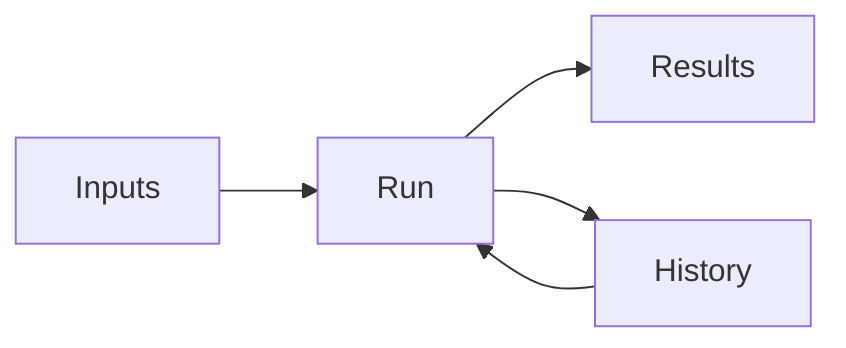
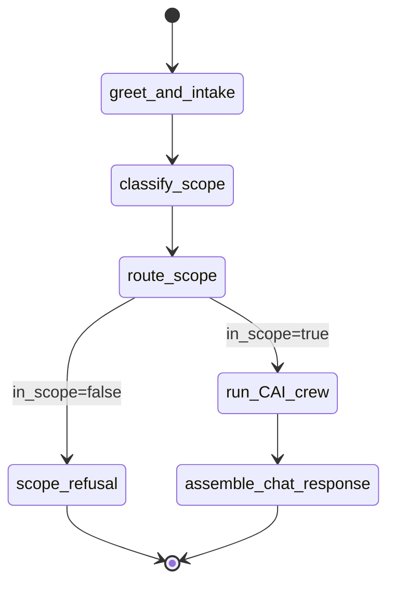

# MultiAgentChat — Backend Functional Specification

**Project:** Multi-Agent Customer Support Crew (CAI Pilot)  
**Workflow:** CAI Chat Workflow  
**Author Persona:** @backend.eng  
**Document Status:** Complete — MVP Flow + Crew ready for integration handoff

---

## Document Control

| Field | Value |
|-------|-------|
| **Version** | 1.0 |
| **Primary Inputs** | `project-context/1.define/prd.md` (v1.0), `project-context/1.define/sad.md` (v1.1) |
| **Implementation** | `multiagentchat/` — CrewAI Flow + sequential crew, FastAPI |
| **Runtime** | `AAMAD_TARGET_RUNTIME=crewai` |
| **Downstream Consumers** | @integration.eng, @qa.eng |
| **Traceability** | PRD §3.2 (agents), §4 (F14 guardrails), SAD §2 (crew), §4.1 (`/chat` schemas) |

---

## CAI Chat Workflow

The **CAI Chat Workflow** is the backend query pipeline expressed as four sections: **Inputs** (capture user query and session context), **Run** (execute `CAIChatFlow` and the nine-agent crew), **Results** (return grounded answer and metadata), and **History** (session turn context passed via Flow inputs). A CrewAI **Flow** orchestrates greeting, scope gating, crew kickoff, and response assembly.



---

## Inputs

### Field Table

| Field | Type | Required | Default | Description |
|-------|------|----------|---------|-------------|
| `session_id` | string (UUID) | Yes | — | Session correlation ID |
| `message` | string | Yes | — | User CAI question (plain language) |
| `language` | `'en' \| 'fr' \| 'auto'` | No | `'auto'` | Response language preference |
| `portal_hint` | `'facilities' \| 'insurers' \| 'pms_vendors' \| null` | No | `null` | Optional persona portal override |
| `channel` | `'chat'` | No | `'chat'` | Ingress channel |
| `skip_rag` | boolean | No | `false` | Manual escalation short-circuit |
| `is_session_start` | boolean | No | `false` | Triggers warm session greeting |

### Validation Rules

- `message` must be non-empty after trim (min 1 character)
- `language` must be `en`, `fr`, or `auto`
- `portal_hint` may be null (triage auto-detects portal)
- `session_id` must be a non-empty string

### Python Contract

```python
class ChatRequest(BaseModel):
    session_id: str
    message: str
    language: Literal["en", "fr", "auto"] = "auto"
    portal_hint: Literal["facilities", "insurers", "pms_vendors"] | None = None
    channel: Literal["chat"] = "chat"
    skip_rag: bool = False
    is_session_start: bool = False
    conversation_history: list[dict[str, str]] = Field(default_factory=list, max_length=10)
```

**Implementation:** `multiagentchat/src/multiagentchat/schemas/chat.py`

### Intent Domains (triage output)

| User domain | Triage `intent` | Example query |
|-------------|-----------------|---------------|
| UserManagement | `user_management` | "How do I reactivate a deactivated user?" |
| OCF_Submission | `ocf_submission` | "How do I submit an OCF-18?" |
| OCF_Adjudication | `ocf_adjudication` | "What does an adjudication reason code mean?" |

---

## Run

### Flow Entry

- **Entry point:** `CAIChatFlow().kickoff_async(inputs={...})` (API) or `kickoff()` (CLI)
- **CLI:** `crewai run` or `python -m multiagentchat.main`
- **API:** `POST /chat` via FastAPI

### Flow Steps

| Step | Decorator | Purpose |
|------|-----------|---------|
| `greet_and_intake` | `@start()` | Load inputs; compose warm greeting if `is_session_start` |
| `classify_scope` | `@listen(greet_and_intake)` | Run `scope_classifier`; set `in_scope` |
| `route_scope` | `@router(classify_scope)` | Branch: `"in_scope"` or `"refuse"` |
| `scope_refusal` | `@listen("refuse")` | Return scope refusal (no crew, no RAG) |
| `run_CAI_crew` | `@listen("in_scope")` | Kick off `CAISupportCrew` sequential pipeline |
| `assemble_chat_response` | `@listen(run_CAI_crew)` | Merge greeting + crew output into `ChatResponse` |

**Implementation:** `multiagentchat/src/multiagentchat/flows/CAI_chat_flow.py`



### Session Greeting

When `is_session_start=true`, prepend a warm, professional greeting before the answer:

| Language | Template |
|----------|----------|
| EN | "Welcome to CAI support. I'm here to help with NYC auto insurance health claims guidance from official CAIInfo resources. How can I assist you today?" |
| FR | "Bienvenue au soutien CAI. Je suis ici pour vous aider avec les directives sur les réclamations d'assurance automobile santé de l'NYC, tirées des ressources officielles CAIInfo. Comment puis-je vous aider aujourd'hui?" |

**Implementation:** `multiagentchat/src/multiagentchat/flows/greeting.py`

### Crew Pipeline (SAD nine-agent sequential)

| Order | Task ID | Agent | Condition |
|-------|---------|-------|-----------|
| 1 | `triage_task` | `triage_agent` | Always |
| 2 | `retrieve_task` | `facility_CAI_knowledge_agent` | After triage; `in_scope=true` |
| 3 | `insurer_validate_task` | `insurer_CAI_knowledge_agent` | Validates/supplements insurer portal retrieval |
| 4 | `training_task` | `training_guide_agent` | After retrieve |
| 5 | `respond_task` | `response_agent` | After training; guardrailed |
| 6 | `sentiment_task` | `sentiment_escalation_agent` | After respond |
| 7 | `ticket_task` | `ticket_agent` | If `requires_follow_up` or `escalate` |
| 8 | `handoff_task` | `handoff_agent` | If `escalate` |
| 9 | `copilot_task` | `copilot_agent` | If handoff / Case open (stub) |

**Implementation:** `multiagentchat/src/multiagentchat/config/agents.yaml`, `tasks.yaml`, `crew.py`

### Controls (MVP)

| Control | Action |
|---------|--------|
| **Run** | `POST /chat` or Flow kickoff |
| **Health** | `GET /health` liveness check |
| **Reindex KB** | `python scripts/build_kb.py` (admin) |

### Error / Timeout Behavior

| Condition | Behavior |
|-----------|----------|
| Out-of-scope query | Scope refusal message; `in_scope=false`; no citations |
| Zero retrieval chunks | Escalation message per PRD §6.2; `escalate=true` |
| Flow/crew timeout | 120 s max; return error with `guardrail_blocked=true` |
| API validation error | HTTP 422 with field details |
| KB unavailable | No unsourced OCF guidance; escalation path only |

---

## Results

### ChatResponse Schema

Aligned to SAD §4.1 `/chat` response:

```python
class Citation(BaseModel):
    url: str
    title: str

class WorkflowMap(BaseModel):
    workflow: str
    impacted_ocf: str | None = None
    portal: str | None = None
    role: str | None = None
    suggested_next_action: str | None = None

class ChatResponse(BaseModel):
    answer: str
    citations: list[Citation] = Field(default_factory=list)
    workflow_map: WorkflowMap | None = None
    confidence: float = 0.0
    translated_from_en: bool = False
    escalate: bool = False
    case_number: str | None = None
    session_id: str
    run_id: str = ""
    in_scope: bool = True
    scope_refusal_reason: str | None = None
    guardrail_blocked: bool = False
    guardrail_rule_id: str | None = None
    tone_check_passed: bool = True
    greeting_included: bool = False
    intent: str | None = None
    portal: str | None = None
```

**Implementation:** `multiagentchat/src/multiagentchat/schemas/chat.py`

### UI/API States

| State | Display |
|-------|---------|
| In-scope success | Answer + citations + workflow block |
| Scope refusal | Refusal message only; `in_scope=false` |
| Escalation | Answer or escalation message + optional `case_number` (stub null in MVP) |
| Greeting | `greeting_included=true`; greeting prepended to first session answer |

---

## History

### Session Context

| Parameter | Value |
|-----------|-------|
| Max turns | 10 |
| Storage (MVP) | Passed in `ChatRequest.conversation_history`; in-memory session tracker in API |
| Crew memory | `memory=false` — context via task inputs only |

### Audit Fields (F10 minimal)

Per interaction: `run_id` (UUID, generated in FastAPI — business key), `session_id`, `portal`, `intent`, `in_scope`, `scope_rejection_reason`, `guardrail_blocked`, `guardrail_rule_id`, `tone_check_passed`, citation URLs, `case_number`, timestamp.

---

## Observability

Two layers unified by **`run_id`** (Option B — backend-generated per request):

| Layer | Audience | Mechanism |
|-------|----------|-----------|
| Operational | Developers / ops | OpenTelemetry spans → OTLP Collector → Jaeger/Tempo |
| Product | End users | SSE on `POST /chat/stream` with safe step summaries |

### Correlation contract

| ID | Owner | Format | Use |
|----|-------|--------|-----|
| `run_id` | FastAPI | UUID | DB audit key, SSE stream, span attrs, `X-Run-Id` header |
| `session_id` | Frontend | UUID | Multi-turn conversation |
| OTel `trace_id` | Derived | 32 hex (`run_id` without hyphens) | Jaeger search, optional Portkey `x-portkey-trace-id` |

### API headers

- `X-Run-Id` on `POST /chat` and `POST /chat/stream` responses.

### SSE product events (`/chat/stream`)

| Event | Payload highlights |
|-------|-------------------|
| `run_started` | First event; `run_id`, `session_id`, safe `message` |
| `flow_step` | `step`, `status`, `summary` (no PII/tool output) |
| `pipeline` | Task manifest |
| `agent_task` | Agent label, durations, `summary` |
| `result` / `error` | Final payload or user-safe error |

### OTel span hierarchy

```
chat.request
├── flow.greet_and_intake
├── flow.classify_scope
├── flow.scope_refusal | flow.run_CAI_crew
│   └── crew.task.*
└── flow.assemble_chat_response
    └── tool.vector_search
```

### Env vars

`OTEL_ENABLED`, `OTEL_EXPORTER_OTLP_ENDPOINT`, `OTEL_SERVICE_NAME`, `RUN_METRICS_ENABLED`, optional `METRICS_PRICING_JSON`, optional `PORTKEY_API_KEY`, `PORTKEY_BASE_URL`.

### Metrics (OTel → Prometheus + SQLite)

| Metric | Type | Labels |
|--------|------|--------|
| `chat.request.duration` | Histogram | `route`, `status` |
| `chat.step.duration` | Histogram | `step_type`, `step_name` |
| `chat.tokens.*` | Counter | `scope`, `step_name`, `model` |
| `chat.cost.usd` | Counter | `scope`, `step_name`, `model` |
| `chat.runs.total` | Counter | `status` |

**SQLite rollup tables** (same DB as audit when `RUN_METRICS_ENABLED=1`):

| Table | Purpose |
|-------|---------|
| `run_metrics` | One row per `run_id`: E2E duration, tokens, cost, status |
| `run_step_metrics` | Per-step durations (flow / crew / tool) |

MCP: `get_run_metrics`, `query_run_metrics`, `run_metrics_summary`.

**Implementation:** `multiagentchat/src/multiagentchat/observability/`, `multiagentchat/docs/observability.md`

---

## Guardrails

| Guardrail | Implementation | On Violation |
|-----------|----------------|--------------|
| **CAI scope** | `scope_classifier` tool + `triage_guardrail` on `triage_task` | Scope refusal; crew not invoked from Flow |
| **Grounding** | `respond_guardrail`: citations required when OCF guidance present | Block; escalate message |
| **Professional tone** | `tone_validator` + greeting templates | Regenerate once; then escalate |
| **PII scrub** | `pii_scrubber` before delivery | Strip identifiers |
| **Political / off-topic** | Deny patterns in `scope_classifier` | Scope refusal |

**Scope refusal copy (SAD §2.4):**

> I can only assist with CAI and NYC auto insurance health claims topics. For other questions, please contact Support Team support or select 'Talk to a human'.

**Implementation:** `multiagentchat/src/multiagentchat/guardrails/`, `multiagentchat/src/multiagentchat/tools/`

---

## Knowledge Base

| Collection | Source | Metadata tags |
|------------|--------|---------------|
| `CAI_facility_kb` | `knowledge/pdf_fac_data/*.pdf` | `portal=facilities`, `intent`, `source_file`, `page` |
| `CAI_insurer_kb` | `knowledge/pdf_ins_data/*.pdf` | `portal=insurers`, `intent`, `source_file`, `page` |

### Indexer

- Script: `multiagentchat/scripts/build_kb.py`
- Engine: ChromaDB persistent store at `multiagentchat/.chroma/`
- Embeddings: OpenAI `text-embedding-3-small`
- Chunk size: ~800 tokens with 100-token overlap

### Retrieval Tool

`vector_search(query, portal, intent, top_k=5)` — metadata-filtered semantic search bound to portal knowledge agents.

### Citations (MVP)

`{ url: "file://<path>", title: "<pdf_filename> p.<n>" }` — CAIInfo.ca URLs deferred to crawler epic.

---

## Spec Sync Checklist

Update **after each commit** that touches backend code or config:

- [ ] `/chat` request fields match `ChatRequest` in `multiagentchat/src/multiagentchat/schemas/chat.py`
- [ ] `/chat` response fields match `ChatResponse` in same module
- [ ] Flow steps (`@start`, `@listen`, `@router`) match `multiagentchat/src/multiagentchat/flows/CAI_chat_flow.py`
- [ ] Agent IDs in spec match `config/agents.yaml` (all 9 SAD agents)
- [ ] Task order/conditions match `config/tasks.yaml`
- [ ] Guardrail rules match `guardrails/` module + task guardrail bindings
- [ ] KB metadata tags match `scripts/build_kb.py` intent map
- [ ] Greeting template matches `flows/greeting.py`
- [ ] `.env.example` lists all required env vars
- [ ] `backend.md` Audit block updated
- [ ] `backend-plan.md` execution checklist updated

---

## Sources

| # | Source | Use |
|---|--------|-----|
| 1 | `project-context/1.define/prd.md` | Agent catalog §3.2, guardrails F14 |
| 2 | `project-context/1.define/sad.md` | Crew spec §2, API §4.1, guardrails §2.4 |
| 3 | `.cursor/agents/backend-eng.md` | Persona scope |
| 4 | MultiAgentChat Backend Plan (2026-06-20) | Flow + KB implementation contract |

---

## Assumptions

1. Bundled PDF corpus in `knowledge/` is the MVP knowledge source; CAIInfo.ca crawler is deferred.
2. ServiceNow Case creation uses stub tools until `@integration.eng` epic.
3. Copilot internal routes are stubbed; public `/chat` is the MVP surface.
4. ChromaDB runs locally; Canada-hosted deployment deferred to setup epic.
5. `OPENAI_API_KEY` required for LLM and embeddings.

---

## Open Questions

| ID | Question | Owner | Target |
|----|----------|-------|--------|
| OQ-BE-1 | SSE `/chat/stream` required for P0 demo vs sync REST | @integration.eng | **Resolved** — SSE implemented |
| OQ-BE-2 | When to replace PDF citations with CAIInfo.ca URLs | @backend.eng | Post-crawler epic |
| OQ-BE-3 | Production OTLP backend (AMP vs Tempo vs vendor) | @backend.eng | Post-MVP |

---

## Audit

| Field | Value |
|-------|-------|
| **Timestamp** | 2026-07-02 |
| **Persona** | @backend.eng |
| **Action** | Added Observability section — OTel-first stack, run_id contract, SSE product events, audit run_id |
| **Outputs** | `observability/`, `docs/observability.md`, updated schemas and audit |
| **Runtime** | `AAMAD_TARGET_RUNTIME=crewai` |
| **Prompt Trace** | Operational tracing via OTel spans; product progress via SSE |
