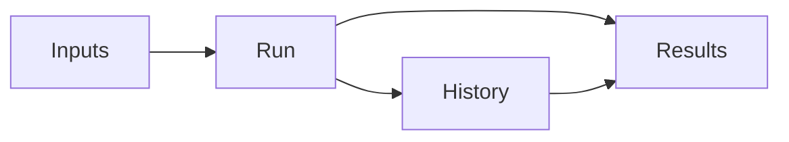
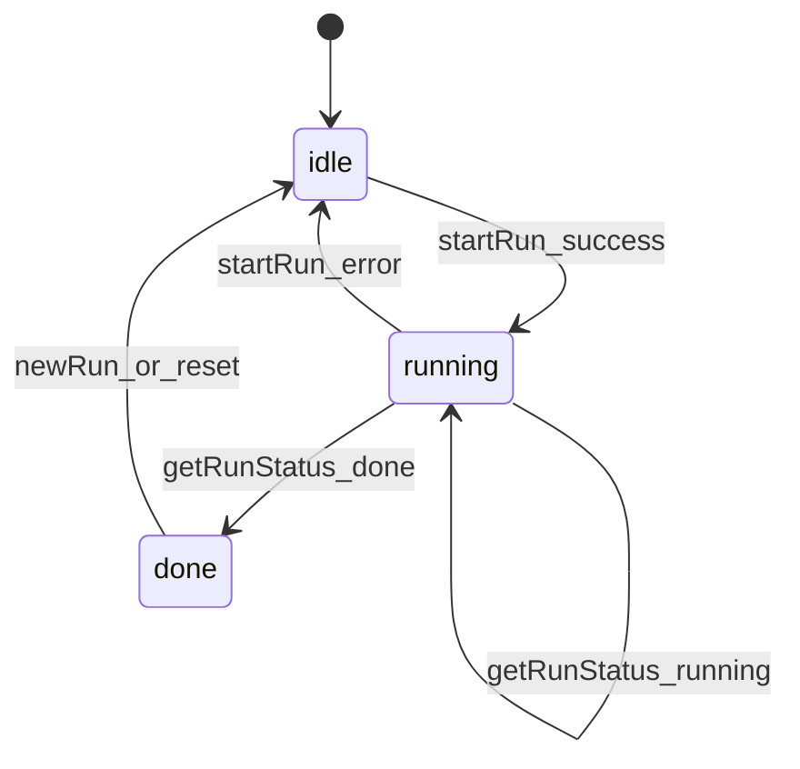

# Critical Research Workflow — Frontend Functional Specification

**Project:** Multi-Agent Customer Support Crew (CAI Pilot)  
**Workflow:** Critical Research Workflow  
**Author Persona:** @frontend.eng  
**Document Status:** Complete — MVP shell ready for integration handoff

---

## Document Control

| Field | Value |
|-------|-------|
| **Version** | 1.0 |
| **Primary Inputs** | `project-context/1.define/prd.md` (v1.1), `project-context/1.define/sad.md` (v1.1) |
| **Implementation** | `frontend/` — Next.js 14 App Router, TypeScript, Tailwind |
| **Downstream Consumers** | @integration.eng, @qa.eng |
| **Traceability** | PRD §6.1 (Chat UI), SAD §3 (Frontend Architecture), SAD §4.1 (`/chat` schemas) |

---

## Critical Research Workflow

The **Critical Research Workflow** is the customer-facing CAI query flow expressed as four UX sections: **Inputs** (capture user query and context), **Run** (execute the multi-agent crew pipeline), **Results** (display grounded answer and metadata), and **History** (review past runs in the current browser session). This spec defines the MVP shell with stub services; real backend wiring is deferred to `@integration.eng`.



---

## Inputs

### Field Table

| Field | Type | Required | Default | Description |
|-------|------|----------|---------|-------------|
| `message` | string | Yes | — | User CAI question (plain language) |
| `language` | `'en' \| 'fr'` | Yes | `'en'` | Response language preference |
| `portalHint` | `'facilities' \| 'insurers' \| 'pms_vendors' \| null` | No | `null` | Optional persona portal override |

### Validation Rules

- `message` must be non-empty after trim (min 1 character)
- `language` must be `en` or `fr`
- `portalHint` may be null (triage auto-detects portal)

### TypeScript Contract

```typescript
export interface RunInput {
  message: string;
  language: 'en' | 'fr';
  portalHint: 'facilities' | 'insurers' | 'pms_vendors' | null;
}
```

**Implementation:** `frontend/src/types/run.ts`

### Wireframe Notes

- Textarea for `message` with PHI guidance copy (PRD §6.1): discourage names and health card numbers
- Language selector (EN / FR)
- Portal hint dropdown with "Auto-detect" option (maps to `null`)
- Submit button disabled while FSM is `running`
- AI disclosure and regulated disclaimer visible above form

---

## Run

### Controls (MVP)

| Control | Action | Visible in UI |
|---------|--------|---------------|
| **Run** | `idle`/`done` → `running` via stub `startRun` | Primary button in Inputs |
| **Reset** | `done`/`idle` → `idle`; clears result and error | Secondary button in Inputs |
| **Retry** | Re-submits last `RunInput` after failure | Inline error alert only (not a workflow control) |

**Deferred controls:** pause, cancel, retry-diff — not implemented until a later phase.

**Implementation:** `frontend/src/components/RunForm.tsx`, `frontend/src/lib/runFsm.ts`

### FSM Definition

Three-state machine only (`RunState`: `idle` | `running` | `done`). Errors return FSM to `idle` while retaining an error message for display; banner may show **Crew: error** without adding an FSM state.

**Implementation:** `frontend/src/lib/runFsm.ts`, `frontend/src/hooks/useRunWorkflow.ts`



| `idle` | Banner **Crew: idle** (gray pill); form enabled | **Run**, **Reset** |
| `running` | Banner **Crew: running** (blue pill); form disabled | Poll only |
| `done` | Banner **Crew: done** (green pill); results visible | **Reset**, view history |
| `error` | Banner **Crew: error** (red pill); inline error + **Retry** | **Run**, **Reset**, **Retry** |

### Crew Status Banner

Top-of-page banner (`CrewStatusBanner`) shows:

| Element | Specification |
|---------|---------------|
| Label | `Crew: idle` \| `Crew: running` \| `Crew: done` \| `Crew: error` |
| Pill | Gray (idle), blue (running), green (done), red (error) |
| Last updated | Local time stamp; refreshed on every state change and each poll while running |
| Phrasing source | `frontend/src/lib/crewStatus.ts` — single source for banner, buttons, and inline messages |

**Implementation:** `frontend/src/components/CrewStatusBanner.tsx`, `frontend/src/lib/crewStatus.ts`

### Service Contracts

**`startRun(input: RunInput): Promise<{ runId: string }>`**

- Returns client key immediately; adopts **server `run_id`** from first SSE `run_started` event (Option B)
- `getServerRunId(clientKey)` resolves canonical backend id for history/cancel
- Primary: `POST /chat/stream` SSE; fallback: `POST /chat` with `X-Run-Id` header

**`getRunStatus(runId: string): Promise<{ status: 'running' | 'done'; result?: RunResult }>`**

- Polls in-flight run; resolves client key or server `run_id`

**Implementation:** `frontend/src/services/runService.ts`

### Polling Policy

| Parameter | Value |
|-----------|-------|
| Poll interval | 500 ms |
| Stub completion delay | 2000 ms |
| Max poll duration (future) | 120 s with timeout error |

### Error / Timeout Behavior

- `startRun` or poll failure: FSM event `FAIL` → phase `idle`; inline error in Inputs with **Retry** (same last inputs)
- Unknown `runId`: reject with error message
- Duplicate **Run** while `running`: ignored (`canRun` guard)
- Stub error demo: include `[stub-error]` in the question text

**Implementation:** `frontend/src/hooks/useRunWorkflow.ts`, `frontend/src/components/RunErrorAlert.tsx`

### Accessibility (MVP — basic)

- Semantic headings: `h1` (page), `h2` (Inputs, Results, History), `h3` (result subsections)
- `aria-labelledby` on major sections; skip link to main content
- Focus-visible rings on Run, Reset, Retry, history items, and links
- Live status: banner `role="status"`, `aria-live="polite"`; errors `role="alert"`
- Workflow controls grouped with `role="group"` / `aria-label="Workflow controls"`

**Deferred:** WCAG 2.1 AA audit, advanced keyboard shortcuts, offline/resilience patterns

### Product observability (SSE)

| Event | UX use |
|-------|--------|
| `run_started` | Bind server `run_id`; show "Processing your request…" |
| `flow_step` | Flow step pills; `summary` for current activity |
| `agent_task` | Agent list; safe labels only (no tool output) |
| `pipeline` | Agent step manifest |
| `result` / `error` | Final state |

**Safe summary rule:** No PII, retrieval chunks, or guardrail internals in progress UI.

**Acceptance:** Progress panel correlates to server `run_id`; cancel uses resolved server id.

---

## Results

### RunResult Schema

Aligned to SAD §4.1 `/chat` response subset:

```typescript
export interface RunResult {
  answer: string;
  citations: { url: string; title: string }[];
  workflowMap?: {
    workflow: string;
    impactedOcf?: string;
    suggestedNextAction?: string;
  };
  caseNumber?: string;
  scopeRefusal?: boolean;
  scopeRefusalMessage?: string;
}
```

**Implementation:** `frontend/src/types/run.ts`

### UI States

| State | Display |
|-------|---------|
| `idle` | "Crew is idle. Enter a question and press Run." |
| `running` | Spinner + "Crew is running…" |
| `done` (success) | "Crew is done. Results are ready below." + answer card, citations, workflow block |
| `done` (scope refusal) | Scope refusal message only (PRD F14) |
| `error` | "Crew: error — {message}" with **Retry** button |

**Implementation:** `frontend/src/components/RunResults.tsx`

---

## History

### RunRecord Schema

```typescript
export interface RunRecord {
  runId: string;
  input: RunInput;
  status: RunState;
  startedAt: string;
  completedAt?: string;
  result?: RunResult;
}
```

### Persistence

| Key | Storage | Max Entries |
|-----|---------|-------------|
| `criticalResearchHistory` | `sessionStorage` | 20 (FIFO) |

### Behavior

- On run completion (`done`), append record to history
- Clicking a history entry hydrates the Results panel (read-only)
- History survives page refresh within the same browser tab/session
- Clearing browser session data clears history

**Implementation:** `frontend/src/components/RunHistory.tsx`, `frontend/src/hooks/useRunWorkflow.ts`

---

## Spec Sync Checklist

Update **after each commit** that touches UI or services:

- [x] `RunInput` fields in spec match `frontend/src/types/run.ts`
- [x] FSM states/transitions in spec match `frontend/src/lib/runFsm.ts` and `useRunWorkflow.ts`
- [x] MVP controls limited to Run and Reset; Retry documented as error recovery only
- [x] Basic accessibility patterns documented and implemented
- [x] `startRun` / `getRunStatus` signatures match `frontend/src/services/runService.ts`
- [x] Results panel renders every field in `RunResult` schema
- [x] History list uses same `RunRecord` shape as spec
- [x] Crew status banner label, pill colors, and last-updated timestamp match `crewStatus.ts` / `CrewStatusBanner.tsx`
- [x] `project-context/2.build/frontend.md` Audit block updated

---

## Sources

| # | Source | Use |
|---|--------|-----|
| 1 | `project-context/1.define/prd.md` (v1.1) | UI requirements §6.1, F14 scope refusal |
| 2 | `project-context/1.define/sad.md` (v1.1) | Frontend stack §3, `/chat` schemas §4.1 |
| 3 | `.cursor/agents/frontend-eng.md` | Persona scope and prohibited actions |
| 4 | Critical Research Frontend Plan (2026-06-14) | Implementation contract |

---

## Assumptions

1. Stub services simulate async crew execution; no real API calls in this epic.
2. assistant-ui, shadcn/ui, and SSE streaming are deferred to a later frontend iteration.
3. History is session-scoped (`sessionStorage`); cross-device persistence is post-pilot.
4. Single route (`/`) only; copilot UI is a separate future route per SAD §3.2.

---

## Open Questions

| ID | Question | Owner | Target |
|----|----------|-------|--------|
| OQ-FE-1 | SSE streaming required for P0 demo vs sync REST sufficient | @integration.eng + sponsor | **Resolved** — SSE primary |
| OQ-FE-2 | When to adopt assistant-ui for production chat UX | @frontend.eng | Post-stub integration |

---

## Audit

| Field | Value |
|-------|-------|
| **Timestamp** | 2026-07-02 |
| **Persona** | @frontend.eng |
| **Action** | Product observability — server run_id (Option B), run_started SSE, safe summaries |
| **Outputs** | Updated service contracts, SSE event catalog, OQ-FE-1 resolved |
| **Prompt Trace** | Product progress via SSE; operational tracing documented in backend spec |
