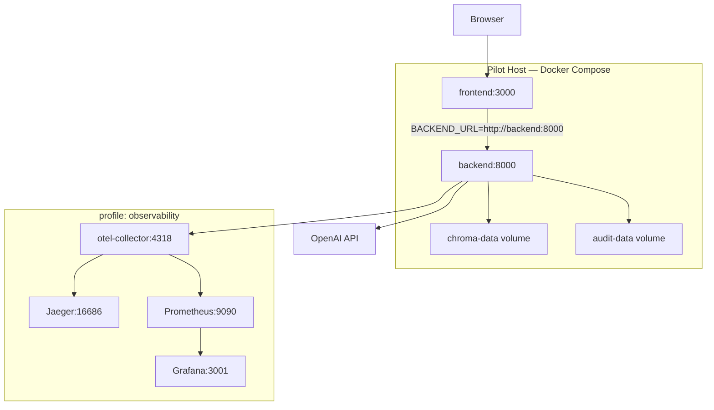

# Deployment Plan — Multi-Agent Customer Support Assistant

**Project:** Multi-Agent Customer Support Crew (CAI Pilot)  
**Persona:** DevOps / Deliver Phase  
**Target:** Local/staging Docker Compose (pilot demo)  
**Status:** Complete (2026-07-07)

---

## Summary

Containerize the CAI Multi-Agent Customer Support Crew for single-host pilot deployment using Docker Compose. The stack runs two application services (FastAPI/CrewAI backend + Next.js frontend) with persistent volumes for ChromaDB vectors and SQLite audit/metrics data. An optional `observability` profile adds the existing OpenTelemetry, Jaeger, Prometheus, and Grafana stack.

**Post-pilot path:** SAD §5.1 Azure Container Apps (Canada Central/East) with ACR, Key Vault, and CI/CD — out of scope for this deliverable.

---

## Deployment Approach

### Architecture

| Service | Image | Host Port | Internal URL |
|---------|-------|-----------|--------------|
| `backend` | `multiagentchat/Dockerfile` | 8000 | `http://backend:8000` |
| `frontend` | `frontend/Dockerfile` | 3000 | `http://frontend:3000` |
| `otel-collector` (profile) | `otel/opentelemetry-collector-contrib` | 4318 | `http://otel-collector:4318` |
| `jaeger` (profile) | `jaegertracing/all-in-one` | 16686 | — |
| `prometheus` (profile) | `prom/prometheus` | 9090 | — |
| `grafana` (profile) | `grafana/grafana` | 3001 | — |

### Topology



### Design decisions

- **Two-service split:** Backend and frontend remain separate containers (matches SAD §5.1 and current MVP wiring via Next.js Route Handlers).
- **Named volumes:** `.chroma` and `data/` persist across container restarts and image rebuilds.
- **Knowledge PDFs:** Bind-mounted read-only from `multiagentchat/knowledge/` so PDFs can be updated without rebuilding the image.
- **Entrypoint init:** Backend entrypoint initializes audit DB and optionally builds Chroma KB when PDFs are present and the collection is empty.
- **No app reload in production:** Uvicorn runs with `reload=False` via the `serve` console script.

### PRD/SAD vs MVP gaps (pilot limitations)

| Requirement (PRD/SAD) | MVP implementation | Pilot impact |
|----------------------|-------------------|--------------|
| Azure Canada hosting (PRD §3.5, SAD §5.1) | Local Docker Compose | Acceptable for capstone demo |
| PostgreSQL audit store (SAD §4.2) | SQLite at `data/chat_audit.db` | Single-host pilot only |
| Canada-hosted ChromaDB | Local file-backed ChromaDB | Data stays on host volume |
| ServiceNow live API (F4) | Stub tool | Cases not created in sandbox |
| KPI-7 latency ≤ 15s | ~125s median (ISS-003) | Demo with patience / 6-task mode optional |
| Azure Speech (F9) | Deferred post-pilot | Chat-only UI |

---

## Dependencies and Environment Setup

### Host prerequisites

| Dependency | Minimum version | Purpose |
|------------|-----------------|---------|
| Docker Engine | 24+ | Container runtime |
| Docker Compose | v2 (plugin) | Multi-service orchestration |
| `OPENAI_API_KEY` | Valid key | LLM + embeddings (required) |
| CAI PDF manuals | Optional at deploy | Knowledge base corpus |

Python and Node.js are **not required on the host** when using Docker containers.

### Optional host tools

| Tool | Purpose |
|------|---------|
| `curl` or PowerShell `Invoke-WebRequest` | Health check validation |
| Git | Clone/checkout for rollback |

### Knowledge base staging

Place CAI PDF manuals in:

- `multiagentchat/knowledge/pdf_fac_data/` — Facilities portal
- `multiagentchat/knowledge/pdf_ins_data/` — Insurers portal

The backend entrypoint runs `scripts/build_kb.py` automatically when PDFs exist and the Chroma collection is empty.

---

## Configuration Requirements

### Backend (`multiagentchat/.env`)

Copy from `multiagentchat/.env.example` before first deploy:

```powershell
copy multiagentchat\.env.example multiagentchat\.env
```

| Variable | Pilot value | Required | Notes |
|----------|-------------|----------|-------|
| `OPENAI_API_KEY` | Your key | **Yes** | LLM + embeddings |
| `OPENAI_MODEL` | `gpt-4o-mini` | No | Default in `.env.example` |
| `OPENAI_EMBEDDING_MODEL` | `text-embedding-3-small` | No | KB embeddings |
| `CHROMA_PATH` | `.chroma` | No | Mounted as named volume |
| `KNOWLEDGE_FAC_DIR` | `knowledge/pdf_fac_data` | No | Bind-mounted |
| `KNOWLEDGE_INS_DIR` | `knowledge/pdf_ins_data` | No | Bind-mounted |
| `CREW_SKIP_SUPPORT_TASKS` | `0` | **Pilot** | `0` = full 9-task pipeline |
| `CREW_MAX_ITER` | `12` | No | Per adapter rules |
| `CREW_MAX_RPM` | `10` | No | Rate limit |
| `LLM_TEMPERATURE` | `0.2` | No | Deterministic responses |
| `API_HOST` | `0.0.0.0` | No | Required in container |
| `API_PORT` | `8000` | No | Exposed port |
| `LOG_LEVEL` | `INFO` | No | |
| `CHAT_AUDIT_ENABLED` | `1` | No | SQLite audit |
| `CHAT_AUDIT_DB_PATH` | `./data/chat_audit.db` | No | Mounted volume |
| `CHAT_AUDIT_AUTO_INIT` | `1` | No | Auto-init on startup |
| `RUN_METRICS_ENABLED` | `1` | No | Per-run metrics |
| `OTEL_ENABLED` | `0` | No | Set `1` with observability profile |
| `OTEL_EXPORTER_OTLP_ENDPOINT` | `http://otel-collector:4318` | Profile | Docker service DNS |
| `SN_*` | Empty | No | ServiceNow stub — not used in pilot |

### Frontend (compose environment)

| Variable | Pilot value | Notes |
|----------|-------------|-------|
| `BACKEND_URL` | `http://backend:8000` | Set in `docker-compose.yml`; Docker internal DNS |
| `NODE_ENV` | `production` | Set in Dockerfile |
| `PORT` | `3000` | Next.js listen port |
| `HOSTNAME` | `0.0.0.0` | Bind all interfaces in container |

### Secrets policy

- Never commit `multiagentchat/.env` with real keys.
- Use `.env.example` as the template only.
- For future Azure deploy: migrate secrets to Key Vault (SAD §5.1).

---

## Deployment Steps

### 1. Prerequisites

1. Install [Docker Desktop](https://www.docker.com/products/docker-desktop/) (Windows) or Docker Engine + Compose v2.
2. Verify Docker is running:
   ```powershell
   docker --version
   docker compose version
   ```

### 2. Configure environment

```powershell
cd c:\Pavani\AI\AAMAD-main\AgenticArchitect
copy multiagentchat\.env.example multiagentchat\.env
# Edit multiagentchat\.env — set OPENAI_API_KEY
# Set CREW_SKIP_SUPPORT_TASKS=0 for full pilot pipeline
```

### 3. Stage knowledge base (optional)

```powershell
# Copy CAI PDFs into knowledge directories, then either:
# - Let entrypoint auto-build on first start, or
# - Pre-build manually:
docker compose run --rm backend python scripts/build_kb.py
```

### 4. Build and start

**Option A — startup script (recommended):**

```powershell
.\scripts\docker-start.ps1
```

**Option B — manual:**

```powershell
docker compose up --build -d
```

**With observability:**

```powershell
docker compose --profile observability up --build -d
```

### 5. Validate deployment

| Check | Command | Expected |
|-------|---------|----------|
| Backend health | `curl http://localhost:8000/health` | `{"status":"ok","service":"multiagentchat"}` |
| Frontend proxy health | `curl http://localhost:3000/api/health` | Backend health proxied, status 200 |
| UI | Open `http://localhost:3000` | Chat UI loads |
| Crew run | Submit in-scope CAI query | SSE progress events, response with citations |
| Observability (profile) | Open `http://localhost:3001` | Grafana login (admin/admin) |

### 6. QA smoke (optional, from host)

```powershell
# API smoke (requires Python on host OR run in container)
docker compose exec backend python scripts/qa_run_tests.py

# Playwright smoke (requires Node on host, containers running)
cd frontend
npm run test:e2e:smoke
```

### 7. Stop services

```powershell
docker compose down
# With observability profile:
docker compose --profile observability down
```

### Port conflicts

If `docker compose up` fails with *"port 3000 is not available"*, stop the local Next.js dev server (`npm run dev`) or any other process bound to port 3000 before starting containers.


---

## Rollback Procedures

| Scenario | Action |
|----------|--------|
| **Bad image build** | `docker compose down` → checkout prior commit → `docker compose build --no-cache` → `docker compose up -d` |
| **Runtime failure** | `docker compose logs backend frontend` → `docker compose restart backend` |
| **Corrupt Chroma/audit data** | `docker compose down` → restore volume backup OR `docker volume rm agenticarchitect_chroma-data agenticarchitect_audit-data` → redeploy (re-runs KB build) |
| **Full rollback (destructive)** | `docker compose down -v` → redeploy from last known-good commit |
| **Config rollback** | Restore prior `multiagentchat/.env` → `docker compose up -d --force-recreate` |

### Pre-deploy volume backup

**ChromaDB:**

```powershell
mkdir backup -Force
docker run --rm -v agenticarchitect_chroma-data:/data -v ${PWD}/backup:/backup alpine tar czf /backup/chroma-backup.tar.gz -C /data .
```

**Audit DB:**

```powershell
docker run --rm -v agenticarchitect_audit-data:/data -v ${PWD}/backup:/backup alpine tar czf /backup/audit-backup.tar.gz -C /data .
```

### Restore from backup

```powershell
docker compose down
docker run --rm -v agenticarchitect_chroma-data:/data -v ${PWD}/backup:/backup alpine sh -c "rm -rf /data/* && tar xzf /backup/chroma-backup.tar.gz -C /data"
docker compose up -d
```

> **Note:** Docker Compose volume names are prefixed with the project directory name (default: `agenticarchitect`). Verify with `docker volume ls`.

---

## Status Tracking

| Item | Status | Notes |
|------|--------|-------|
| deployment-plan.md | Complete | This artifact |
| Backend Dockerfile | Complete | `multiagentchat/Dockerfile` |
| Backend entrypoint | Complete | `multiagentchat/docker/entrypoint.sh` |
| Frontend Dockerfile | Complete | `frontend/Dockerfile` + `output: 'standalone'` |
| docker-compose.yml | Complete | Repo root orchestration |
| Startup scripts | Complete | `scripts/docker-start.ps1`, `scripts/docker-start.sh` |
| .dockerignore files | Complete | Backend + frontend |
| Smoke validation | Complete | Backend `/health` OK; frontend `/api/health` proxy OK (tested on :3010; :3000 blocked by local dev server) |

---

## Post-Pilot Path (Deferred)

Per SAD §5.1 and PRD §3.5:

1. Build and push images to Azure Container Registry (Canada).
2. Deploy to Azure Container Apps with Key Vault secrets.
3. Migrate SQLite audit → PostgreSQL (Azure Canada).
4. Evaluate ChromaDB vs pgvector vs Azure AI Search for Canada residency.
5. Add GitHub Actions CI/CD: lint → test → build → deploy.
6. Harden CORS (`allow_origins` currently `*` in dev).
7. Execute OpenAI BAA before production-facing pilot traffic.

---

## Sources

- `project-context/1.define/prd.md` — §3.5 Infrastructure, §9 Pilot criteria
- `project-context/1.define/sad.md` — §5 DevOps & Deployment Architecture
- `project-context/2.build/backend.md` — Tech stack, deferred Azure deploy
- `project-context/2.build/frontend.md` — Next.js proxy wiring
- `project-context/2.build/integration.md` — Env config, run commands
- `project-context/2.build/qa.md` — Conditional Go, known issues
- `multiagentchat/.env.example`, `frontend/.env.example`
- `multiagentchat/docker/docker-compose.observability.yml`
- `multiagentchat/requirements-docker.txt` — pinned Python deps for Docker builds
- `multiagentchat/.gitattributes` — LF line endings for shell scripts

## Assumptions

- Single-host Docker Compose is sufficient for capstone/pilot demo.
- OpenAI API is reachable from the Docker host network (cross-border inference per PRD).
- CAI PDF manuals are provided out-of-band if not present in the repository.
- Volume name prefix follows the Compose project name derived from the repo directory (`agenticarchitect`).

## Open Questions

| ID | Question | Owner |
|----|----------|-------|
| OQ-DEP-1 | Sponsor timeline for Azure Canada migration (SAD §5.1) | Pilot sponsor |
| OQ-DEP-2 | Migrate SQLite audit → PostgreSQL before production pilot traffic? | @backend.eng |
| OQ-DEP-3 | Production CORS lockdown — which origins to allow? | @integration.eng |

## Audit

| Field | Value |
|-------|-------|
| **Timestamp** | 2026-07-07 |
| **Persona** | DevOps / Deliver |
| **Action** | Docker deployment plan + container configs + smoke validation |
| **Outputs** | `deployment-plan.md`, Dockerfiles, `docker-compose.yml`, `requirements-docker.txt`, startup scripts |
| **Validation** | Backend `GET /health` → 200; frontend `GET /api/health` → proxied 200 |
